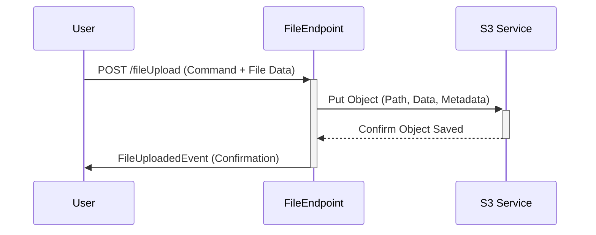

# Chapter 1: File Endpoint & F2 Functions

Welcome to the `connect-fs` tutorial! Imagine you have a bunch of files – documents, images, videos – that you need to store, retrieve, and manage somewhere central. How do you actually *talk* to the service that handles all this? That's where our first concept comes in: the **File Endpoint** and **F2 Functions**.

Think of `connect-fs` as a specialized digital librarian. You need a way to interact with this librarian – to ask for specific books (files), to see what books are in a certain section (list files), or to give the librarian a new book to store (upload a file).

## The Main Entrance: `FileEndpoint`

The `FileEndpoint` is like the main reception desk or the front door of our file library. It's the primary place where all requests come in. If you want to do *anything* with files in `connect-fs`, you'll go through the `FileEndpoint`.

In technical terms, `FileEndpoint` is a class in the code that listens for incoming requests (usually over the web using HTTP).

```kotlin
// Simplified from fs-s2/file/fs-file-app/src/main/kotlin/io/komune/fs/s2/file/app/FileEndpoint.kt
@RestController // Tells the system this class handles web requests
@RequestMapping // Basic configuration for web paths
class FileEndpoint(
    // ... dependencies needed for the endpoint to work ...
) {
    // ... functions to handle specific file actions ...
}
```

*   `@RestController`: A label telling the Spring framework (which helps build the service) that this class will handle web requests.
*   `@RequestMapping`: Specifies the base web address for this endpoint.
*   Inside this class, we define specific actions you can perform.

## Structuring Actions: The F2 Framework (Queries & Commands)

Just like a restaurant menu organizes food into appetizers, main courses, and desserts, we need a way to organize the different actions you can perform with files. `connect-fs` uses a system called the **F2 Framework** for this.

F2 helps organize actions into two main categories:

1.  **Queries:** Asking for information. These actions **read** data but don't change anything.
    *   *Analogy:* Asking the waiter, "What's in the soup?" or "Can I see the dessert menu?"
    *   *Examples in `connect-fs`:*
        *   `fileGet`: Get details about a *single* specific file.
        *   `fileList`: Get a list of files in a specific folder.

2.  **Commands:** Telling the service to *do* something. These actions **change** data (create, update, delete).
    *   *Analogy:* Telling the waiter, "I'd like to order the steak," or "Please bring the bill."
    *   *Examples in `connect-fs`:*
        *   `fileUpload`: Add a new file or replace an existing one.
        *   `fileDelete`: Remove a file.

This Query/Command separation makes the system predictable and easier to understand. You know whether you're just looking at information or making a change.

## How to Use It: Examples

Let's see how you'd interact with the `FileEndpoint` using these F2 functions.

**Example 1: Listing Files (A Query)**

Imagine you want to see all the files related to a specific project ("Project Alpha") in its "documents" directory.

1.  **Your Request (Input):** You send a `FileListQuery`. This is like filling out a request form.

    ```kotlin
    // This isn't exactly code you write, but represents the data you send
    val listRequest = FileListQuery(
        objectType = "project", // Category of the item
        objectId = "project-alpha-id", // Specific item ID
        directory = "documents", // Folder within the item
        recursive = false // Just list files directly here, not in subfolders
    )
    ```

2.  **The Service's Response (Output):** The `FileEndpoint` receives this, uses the `fileList` function, and sends back a `FileListResult`.

    ```kotlin
    // This represents the data you get back
    val listResponse = FileListResult(
        items = listOf(
            File(id = "file-id-1", name = "report.pdf", ...), // Details of file 1
            File(id = "file-id-2", name = "meeting_notes.txt", ...) // Details of file 2
        )
    )
    ```

**Example 2: Uploading a File (A Command)**

Now, let's say you want to upload a new file named `logo.png` for the same project into an "images" directory.

1.  **Your Request (Input):** You send a `FileUploadCommand` *and* the actual file data.

    ```kotlin
    // The command part (metadata about the upload)
    val uploadCommand = FileUploadCommand(
        path = FilePath( // More on FilePath in the next chapter!
            objectType = "project",
            objectId = "project-alpha-id",
            directory = "images",
            name = "logo.png"
        ),
        metadata = mapOf("uploadedBy" to "Alice"), // Optional extra info
        vectorize = false // Don't do special processing for now
    )
    // AND you send the actual bytes of logo.png
    ```

2.  **The Service's Response (Output):** The `FileEndpoint` receives the command and the file, uses the `fileUpload` function (which saves the file), and sends back a `FileUploadedEvent` confirming the action.

    ```kotlin
    // Confirmation you get back
    val uploadResponse = FileUploadedEvent(
        id = "new-file-id-3", // A unique ID for the uploaded file
        path = uploadCommand.path, // The path where it was saved
        url = "https://your-fs-service.com/...", // A web link to the file
        hash = "aBcDeFg...", // A fingerprint of the file content
        metadata = mapOf("uploadedBy" to "Alice", "id" to "new-file-id-3"),
        time = 1678886400000 // Timestamp of the upload
    )
    ```

## Under the Hood: How It Works

When you send a request (like uploading a file):

1.  Your request (e.g., an HTTP POST) arrives at the `connect-fs` service.
2.  Spring Boot (the underlying web framework) directs the request to the `FileEndpoint`.
3.  Based on the request's URL path (like `/fileUpload`) and type (POST), `FileEndpoint` figures out which function to call (e.g., the `fileUpload` function).
4.  The F2 function logic inside `FileEndpoint` runs. For `fileUpload`, this involves:
    *   Getting the command details (`FileUploadCommand`) and the file data.
    *   Calling the [S3 Service](04_s3_service_.md) (which actually handles talking to the file storage).
    *   Possibly interacting with other components like the event sourcing system ([Event Sourcing / SSM (S2 Automate)](06_event_sourcing___ssm__s2_automate__.md)) if needed.
    *   Preparing the response event (`FileUploadedEvent`).
5.  `FileEndpoint` sends the response back to you.

Here's a simplified diagram showing the `fileUpload` flow:



**Diving into the Code:**

*   **Defining an F2 Function:** In `FileEndpoint.kt`, F2 functions are often defined using `@Bean` and `f2Function`. This makes them discoverable by the framework.

    ```kotlin
    // Simplified from FileEndpoint.kt - fileGet function
    @Bean // Makes this function available to the system
    fun fileGet(): FileGetFunction = f2Function { query -> // query is the FileGetQuery input
        logger.info("fileGet: ${query}") // Log the request

        // 1. Ask the S3 Service for file info based on the query path
        val fileDetails = s3Service.statObject(query.toString())

        // 2. Prepare the result
        val result = if (fileDetails != null) {
             // ... build the File object from details ...
             FileGetResult(item = /* the File object */)
        } else {
             FileGetResult(item = null) // File not found
        }

        result // Return the FileGetResult
    }
    ```
    This code takes a `FileGetQuery` (which is just a [FilePath](02_filepath_.md)), asks the [S3 Service](04_s3_service_.md) for the file's status, and returns the details in a `FileGetResult`.

*   **Handling HTTP Requests:** For actions like file uploads that don't fit the standard F2 query/command pattern perfectly (because they involve file data alongside JSON commands), standard Spring Web annotations like `@PostMapping` are used.

    ```kotlin
    // Simplified from FileEndpoint.kt - fileUpload function
    @PostMapping("/fileUpload") // Handles HTTP POST requests to /fileUpload
    suspend fun fileUpload(
        @RequestPart("command") cmd: FileUploadCommand, // Expects JSON data named "command"
        @RequestPart("file") file: FilePart // Expects file data named "file"
    ): FileUploadedEvent {
        logger.info("fileUpload: $cmd")

        // 1. Get file content
        val fileByteArray = file.contentByteArray()

        // 2. Tell S3 Service to save the file
        s3Service.putObject(
            path = cmd.path.toString(), // Where to save
            content = fileByteArray,    // What to save
            metadata = cmd.metadata     // Extra info
            // ... other details ...
        )

        // 3. Create and return the confirmation event
        return FileUploadedEvent(
            // ... details like id, path, url, hash ...
        )
    }
    ```
    This function explicitly handles a POST request, extracts the command data and the file data separately (`@RequestPart`), tells the [S3 Service](04_s3_service_.md) to store the file, and returns the confirmation.

*   **Dependencies:** The magic behind F2 and web handling comes from libraries included in the project's build file (`build.gradle.kts`).

    ```gradle
    // From fs-api/api-gateway/build.gradle.kts
    dependencies {
        // Core F2 library for function handling via HTTP
        api("io.komune.f2:f2-spring-boot-starter-function-http:${Versions.f2}")

        // Project modules containing definitions and configurations
        implementation(project(":fs-api:api-config"))
        implementation(project(":fs-s2:file:fs-file-app"))
        // ... other dependencies ...
    }
    ```
    This shows we're including the necessary F2 and Spring Boot tools.

## Conclusion

You've learned about the `FileEndpoint`, the main entry point for interacting with `connect-fs`. You also discovered the F2 framework's approach of using **Queries** (to ask for information like `fileList`) and **Commands** (to perform actions like `fileUpload` or `fileDelete`). This structured approach, combined with the `FileEndpoint`, provides a clear and predictable way to manage your files.

We saw that requests often involve specifying *where* a file should be or where to look for files. This "where" is defined by a concept called `FilePath`. In the next chapter, we'll dive deep into how `FilePath` works.

Ready to learn about paths? Let's go to [Chapter 2: FilePath](02_filepath_.md)!

---

Generated by [AI Codebase Knowledge Builder](https://github.com/The-Pocket/Tutorial-Codebase-Knowledge)