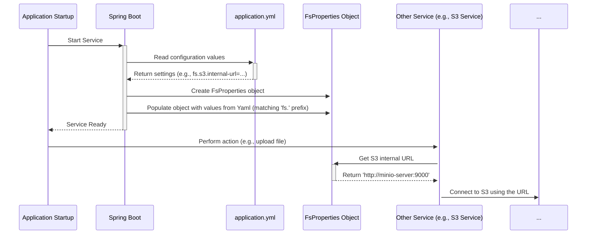

# Chapter 3: Configuration (FsProperties)

In [Chapter 2: FilePath](02_filepath_.md), we learned how to create a precise "address" (`FilePath`) for every file, telling the system *where* a file belongs (like `project/project-123/images/logo.png`). But how does the `connect-fs` service itself know where to find the actual file storage (like an S3 server)? How does it know the login details, or which storage "bucket" (like a main folder) to use?

Think about setting up a new smart speaker. You need to tell it your Wi-Fi network name and password, maybe link it to your streaming accounts. Without this setup information, it can't do anything useful! Similarly, `connect-fs` needs its own setup instructions to function correctly.

## The Instruction Manual: `FsProperties`

**`FsProperties`** is the central place where all these crucial setup details for the `connect-fs` service are stored. It acts like the service's instruction manual and configuration sheet, gathered from settings files (like `application.yml`) when the service starts up.

It tells the service things like:

*   Where is the S3 server located? (`internal-url`, `external-url`)
*   How do I log in to the S3 server? (`username`, `password`)
*   Which specific S3 "bucket" should I use by default? (`fs.space.name`)
*   Alternatively, how can I figure out the bucket based on the user requesting the file (using information from a JWT token)? (`fs.space.jwt`)
*   Are there optional features like connecting to a Blockchain/SSM system enabled, and if so, what are their details?

Without `FsProperties`, the service wouldn't know how or where to store and retrieve your files.

## Key Settings You'll Configure

Let's look at the most important settings managed by `FsProperties`, which you'll typically define in a file named `application.yml`.

**1. Connecting to S3 Storage**

This is the most fundamental part. You need to tell `connect-fs` how to reach your S3-compatible storage (like MinIO or AWS S3).

```yaml
# In application.yml
fs:
  s3:
    internal-url: http://minio-server:9000 # Address FS uses to talk to S3
    external-url: https://my-files.example.com # Public address for file links
    region: us-east-1          # S3 server location (optional usually)
    username: your-s3-user     # Login username for S3
    password: your-s3-password # Login password for S3
    dns: false                 # How bucket names appear in URLs (usually false)
```

*   `internal-url`: The network address the `connect-fs` service uses *internally* to communicate with the S3 server.
*   `external-url`: The address used to create public-facing links to the files. This might be different from the internal one.
*   `username` / `password`: Credentials needed to access the S3 storage.
*   `region`: Sometimes needed depending on your S3 provider.
*   `dns`: Controls whether the bucket name is part of the domain name (`true`) or path (`false`) in generated URLs.

These settings correspond to a data structure in the code:

```kotlin
// Simplified from fs-api/api-config/src/main/kotlin/io/komune/fs/api/config/FsProperties.kt
data class S3Properties(
    var internalUrl: String, // Corresponds to fs.s3.internal-url
    var externalUrl: String, // Corresponds to fs.s3.external-url
    var region: String,
    var username: String,
    var password: String,
    var dns: Boolean = false,
    // ... other related S3 properties ...
)
```
This Kotlin `data class` simply holds the values read from the `application.yml` file.

**2. Specifying the S3 Bucket**

An S3 server can contain multiple "buckets", which are like top-level folders. `connect-fs` needs to know which bucket to put the files into. There are two main ways to configure this:

*   **Fixed Bucket Name:** You tell `connect-fs` to always use the *same* bucket for all files.

    ```yaml
    # In application.yml
    fs:
      space:
        name: my-project-files # All files go into the 'my-project-files' bucket
      s3:
        # ... other s3 settings ...
    ```

*   **Dynamic Bucket via JWT:** You can configure `connect-fs` to look inside a user's security token (a JWT - JSON Web Token) to find the name of the bucket they should use. This is useful in multi-tenant systems where each customer might have their own bucket.

    ```yaml
    # In application.yml
    fs:
      space:
        # No fixed name here!
        jwt:
          claim: user_bucket # Look for a claim named 'user_bucket' in the JWT
      s3:
        # ... other s3 settings ...
    ```
    In this case, if a user logs in and their JWT contains `"user_bucket": "customer-a-files"`, `connect-fs` will use the `customer-a-files` bucket for that user's requests.

These settings are represented in the code like this:

```kotlin
// Simplified from FsProperties.kt
data class FsProperties (
    val s3: S3Properties,
    val space: SpaceProperties?, // Holds bucket configuration
    // ... other properties ...
)

data class SpaceProperties(
    val name: String?, // Fixed bucket name (from fs.space.name)
    val jwt: JwtProperties? // JWT configuration (from fs.space.jwt)
)

data class JwtProperties(
    // Name of the claim in the JWT holding the bucket name
    val claim: String? = "space" // Default is "space"
)
```

**3. Optional: SSM/Blockchain and Redis**

`connect-fs` can optionally integrate with other systems:

*   **SSM/Blockchain:** To log file events or store file hashes securely. Configuration involves details about the SSM network, chaincode, and Redis cache. We'll explore this more in [Chapter 6: Event Sourcing / SSM (S2 Automate)](06_event_sourcing___ssm__s2_automate__.md).
*   **Redis:** Used as a cache, especially when SSM integration is enabled. Standard Redis connection properties (`spring.redis.host`, `spring.redis.port`, etc.) are used.

You only need to configure these if you plan to use those features.

```yaml
# Example optional settings in application.yml
fs:
  ssm: # Settings for SSM/Blockchain
    channel: my-channel
    chaincode: my-chaincode
    # ... other signer details ...

spring:
  redis: # Settings for Redis cache
    host: redis-server
    port: 6379
    password: redis-password
```

**4. Initializing Buckets**

Sometimes, you might want `connect-fs` to automatically create the S3 buckets if they don't exist when the service starts.

```yaml
# In application.yml
fs:
  init:
    buckets: my-project-files, another-bucket # Create these buckets on startup
  # ... other settings ...
```

This uses the `BucketInitProperties`:

```kotlin
// Simplified from FsProperties.kt
data class BucketInitProperties(
    // Comma-separated list of buckets to ensure exist
    val buckets: String,
)
```

## How is `FsProperties` Used?

Different parts of the `connect-fs` service need these settings to do their jobs. For example:

*   The component that actually talks to S3 (the [S3 Service](04_s3_service_.md)) needs the S3 URL, credentials, and bucket name.
*   The component that figures out *which* bucket to use (the [S3 Bucket Provider](05_s3_bucket_provider_.md)) needs the `fs.space` configuration (either the fixed name or the JWT claim name).
*   The [File Endpoint & F2 Functions](01_file_endpoint___f2_functions_.md) might use the `external-url` to generate downloadable links for files.

These components don't read `application.yml` directly. Instead, they ask the `FsProperties` object (which has already loaded the settings) for the information they need.

## Under the Hood: Loading the Configuration

How do the settings from `application.yml` actually get into the `FsProperties` object in the code?

1.  **Startup:** When the `connect-fs` service starts, the Spring Boot framework kicks in.
2.  **Reading Settings:** Spring Boot automatically looks for configuration files like `application.yml`. It also checks for other sources like environment variables or command-line arguments.
3.  **Matching Prefixes:** It specifically looks for settings that start with the prefix `fs.` (because our main configuration class `FsProperties` is annotated with `@ConfigurationProperties(prefix = "fs")`).
4.  **Populating the Object:** Spring Boot intelligently matches the names in the configuration file (like `fs.s3.internal-url`) to the fields inside the `FsProperties` and `S3Properties` classes and fills them with the values.
5.  **Making it Available:** The fully populated `FsProperties` object is then made available for other parts of the application to use.



**Code Glimpse: Enabling and Using Properties**

This magic is enabled by a couple of key annotations in the configuration setup code:

```kotlin
// In fs-api/api-config/src/main/kotlin/io/komune/fs/api/config/FsConfig.kt

@Configuration // Marks this class as a source of configuration
// Tells Spring to find 'fs.*' properties and load them into FsProperties
@EnableConfigurationProperties(FsProperties::class)
class FsConfig {

    // This function creates the S3 client library object
    @Bean // Makes the result available to other parts of the app
    fun minioClient(fsProperties: FsProperties): MinioClient {
        // It ASKS for the FsProperties object (already loaded by Spring)
        return MinioClient.builder()
            // Uses the loaded properties to configure the client
            .endpoint(fsProperties.s3.internalUrl)
            .credentials(fsProperties.s3.username, fsProperties.s3.password)
            // ... other configurations using fsProperties ...
            .build()
    }

    // Other configuration beans can also ask for FsProperties
}
```

*   `@Configuration`: Tells Spring this class defines setup instructions.
*   `@EnableConfigurationProperties(FsProperties::class)`: This is the key! It links the `application.yml` settings starting with `fs.` to the `FsProperties` class.
*   `fun minioClient(fsProperties: FsProperties)`: When Spring creates the `minioClient`, it sees that it needs an `FsProperties` object. Since `FsProperties` was loaded automatically, Spring provides the populated object here. The function then uses the values from `fsProperties` (like `fsProperties.s3.internalUrl`) to set up the S3 client correctly.

## Conclusion

You've now seen how `FsProperties` acts as the central configuration hub for `connect-fs`. It gathers all the necessary setup instructions—like S3 connection details and bucket information—from files like `application.yml`. This configuration tells the different parts of the service how to connect to external systems (like S3) and how they should behave. Without proper configuration in `FsProperties`, the service simply wouldn't work.

Now that we understand how the service gets its instructions, let's look at the component that follows these instructions to actually interact with the S3 storage system.

Ready to talk to S3? Let's move on to [Chapter 4: S3 Service](04_s3_service_.md)!

---

Generated by [AI Codebase Knowledge Builder](https://github.com/The-Pocket/Tutorial-Codebase-Knowledge)