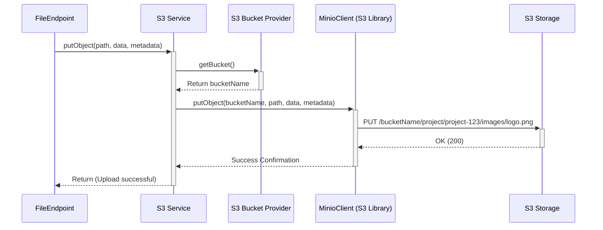

# Chapter 4: S3 Service

In [Chapter 3: Configuration (FsProperties)](03_configuration__fsproperties__.md), we saw how `connect-fs` gets its instructions – things like the address of the S3 server (`internal-url`), the login details (`username`, `password`), and which storage "bucket" to use. This configuration is essential, but it doesn't actually *do* the work of talking to the S3 storage.

So, which part of the system takes those instructions and performs the real actions like storing a file, fetching it, or listing the contents of a folder in the S3 bucket? That's the job of the **S3 Service**.

## Meet the Warehouse Worker: `S3Service`

Think back to our digital librarian analogy. The [File Endpoint & F2 Functions](01_file_endpoint___f2_functions_.md) is the front desk where you make requests. The [Configuration (FsProperties)](03_configuration__fsproperties__.md) is the address book and access key list for the warehouse.

The **`S3Service`** is the actual warehouse worker. It's the component that physically goes into the storage (our S3 bucket), puts files onto shelves, retrieves them when asked, checks if a file exists, lists what's on a shelf, and removes items. It directly interacts with the S3-compatible storage system (like MinIO or AWS S3) using the details provided by `FsProperties`.

It hides the messy details of S3 communication from the rest of the application. The `FileEndpoint` doesn't need to know *how* to speak the S3 protocol; it just tells the `S3Service` what needs to be done.

## How Other Components Use `S3Service`

The `S3Service` doesn't usually get called directly by you (the end-user). Instead, other components within `connect-fs`, primarily the `FileEndpoint`, use it to fulfill your requests.

Let's revisit the `fileUpload` example from Chapter 1.

**Use Case: Uploading `logo.png`**

1.  **You:** Send a `FileUploadCommand` (with the [FilePath](02_filepath_.md) `project/project-123/images/logo.png`) and the actual `logo.png` file data to the `FileEndpoint`.
2.  **`FileEndpoint`:** Receives your request. It knows it needs to store this file.
3.  **`FileEndpoint` calls `S3Service`:** Instead of talking to S3 directly, `FileEndpoint` delegates the task. It calls the `putObject` function within the `S3Service`.

```kotlin
// Simplified logic inside FileEndpoint's fileUpload function
suspend fun fileUpload(cmd: FileUploadCommand, file: FilePart) {
    val pathString = cmd.path.toString() // "project/project-123/images/logo.png"
    val fileBytes = file.contentByteArray() // The actual image data
    val metadata = cmd.metadata.plus("id" to UUID.randomUUID().toString())

    // *** Tell the S3Service to store the file ***
    s3Service.putObject(
        path = pathString,
        content = fileBytes,
        metadata = metadata
    )

    // ... prepare the FileUploadedEvent response ...
}
```

*   The `FileEndpoint` takes the `FilePath` (converted to a string), the file content (`ByteArray`), and any metadata.
*   It calls `s3Service.putObject`, handing over the responsibility of storage.

**Other Common Interactions:**

*   **Getting File Info (`fileGet`):** The `FileEndpoint` calls `s3Service.statObject(pathString)` to get details like file size and last modification date.
*   **Listing Files (`fileList`):** The `FileEndpoint` calls `s3Service.listObjects(prefix, recursive)` to get a list of files within a directory.
*   **Deleting Files (`fileDelete`):** The `FileEndpoint` calls `s3Service.removeObject(pathString)` to delete a file.

In all these cases, the `FileEndpoint` acts as the manager, deciding *what* needs to be done based on your request, while the `S3Service` is the specialist who knows *how* to perform the action on the S3 storage.

## Under the Hood: Talking to S3

How does the `S3Service` actually communicate with the S3 storage system?

**The Workflow (e.g., for `putObject`)**

1.  **Receive Request:** The `S3Service.putObject` function is called by `FileEndpoint` with the path string (`"project/project-123/images/logo.png"`), the file data, and metadata.
2.  **Determine Bucket:** The `S3Service` needs to know *which* S3 bucket to put the file in. It uses the [S3 Bucket Provider](05_s3_bucket_provider_.md) component (which we'll cover next) to get the correct bucket name. The `S3BucketProvider` figures this out based on the configuration in `FsProperties` (either a fixed name or one derived from a JWT).
3.  **Use S3 Client:** The `S3Service` has access to a pre-configured S3 client object (specifically, a `MinioClient` object, which works with many S3-compatible systems). This client object was set up when the application started, using the URL and credentials from `FsProperties` ([Chapter 3: Configuration (FsProperties)](03_configuration__fsproperties__.md)).
4.  **Build S3 Command:** It constructs the specific command needed for the S3 client, like `PutObjectArgs` for uploading. This includes the bucket name, the object key (our path string), the file data stream, file size, and metadata.
5.  **Execute Command:** It tells the `MinioClient` to execute the command, sending the request to the actual S3 server.
6.  **Handle Response:** The S3 server responds, and the `MinioClient` relays this back. The `S3Service` might handle basic confirmations or specific errors (like "file not found" during a `statObject` call).

**Sequence Diagram:**



**Diving into the Code (`S3Service.kt`)**

The `S3Service` class itself is quite straightforward. It receives the tools it needs (the `MinioClient` and the `S3BucketProvider`) when it's created.

```kotlin
// Simplified from fs-s2/file/fs-file-app/src/main/kotlin/io/komune/fs/s2/file/app/service/S3Service.kt
@Service // Marks this as a service managed by the framework
class S3Service(
    // These are provided automatically based on beans created in FsConfig
    private val minioClient: MinioClient,
    private val s3BucketProvider: S3BucketProvider
) {
    // ... functions for S3 operations ...
}
```

*   `@Service`: A Spring annotation indicating this class provides business logic.
*   `minioClient`: The configured client library for talking S3 protocol.
*   `s3BucketProvider`: The helper to determine the target bucket name.

Let's look at a simplified `putObject` implementation:

```kotlin
// Simplified from S3Service.kt
suspend fun putObject(path: String, content: ByteArray, metadata: Map<String, String>) {
    // 1. Get the bucket name
    val bucket = s3BucketProvider.getBucket()

    // 2. Build the arguments for the S3 client library
    val args = PutObjectArgs.builder()
        .bucket(bucket)          // Which bucket
        .`object`(path)          // What object key (path/filename)
        .stream(content.inputStream(), content.size.toLong(), -1) // Data
        .userMetadata(metadata)  // Custom metadata
        // .contentType(...)    // Set content type (e.g., 'image/png')
        .build()

    // 3. Tell the client library to execute the upload
    minioClient.putObject(args)
}
```

*   It first asks the `s3BucketProvider` for the name of the bucket to use.
*   It then uses a builder pattern (`PutObjectArgs.builder()`) provided by the `minio-java` library to construct the request details.
*   Finally, it calls `minioClient.putObject()` with the prepared arguments.

And here's a simplified `statObject` to get file metadata:

```kotlin
// Simplified from S3Service.kt
suspend fun statObject(path: String): StatObjectResponse? {
    val bucket = s3BucketProvider.getBucket()
    try {
        // Build arguments to ask for object status
        val args = StatObjectArgs.builder()
            .bucket(bucket)
            .`object`(path)
            .build()

        // Ask the client library for the object's status
        return minioClient.statObject(args)
    } catch (e: ErrorResponseException) {
        // If S3 says "NoSuchKey", it means the file doesn't exist. Return null.
        if (e.errorResponse().code() == "NoSuchKey") {
            return null
        } else {
            // For other errors, let them propagate
            throw e
        }
    }
}
```

*   Similar pattern: get bucket, build arguments (`StatObjectArgs`), call client (`minioClient.statObject`).
*   Crucially, it includes error handling (`try...catch`) to specifically check if the S3 server responded with a "NoSuchKey" error (which means the file wasn't found), returning `null` in that case instead of crashing.

The other functions (`removeObject`, `listObjects`, `getObject`, `setBucketPolicy`, etc.) follow similar patterns: get the bucket name, build the appropriate arguments using the `minio-java` library, and call the corresponding method on the `minioClient`.

## Conclusion

You've now met the `S3Service`, the essential component in `connect-fs` that acts as the bridge to your S3-compatible storage. It takes instructions from higher-level components like the `FileEndpoint` and uses the configuration from `FsProperties` (via the `MinioClient` and `S3BucketProvider`) to perform the low-level tasks of storing, retrieving, listing, and deleting files. It handles the direct communication with the S3 server, keeping those details hidden from the rest of the application.

We saw that the `S3Service` relies on something called the `S3BucketProvider` to figure out *which* bucket to use for each operation. How does that provider work, especially when dealing with dynamic bucket names from JWTs?

Let's find out in the next chapter! Ready to learn about bucket selection? Onwards to [Chapter 5: S3 Bucket Provider](05_s3_bucket_provider_.md)!

---

Generated by [AI Codebase Knowledge Builder](https://github.com/The-Pocket/Tutorial-Codebase-Knowledge)