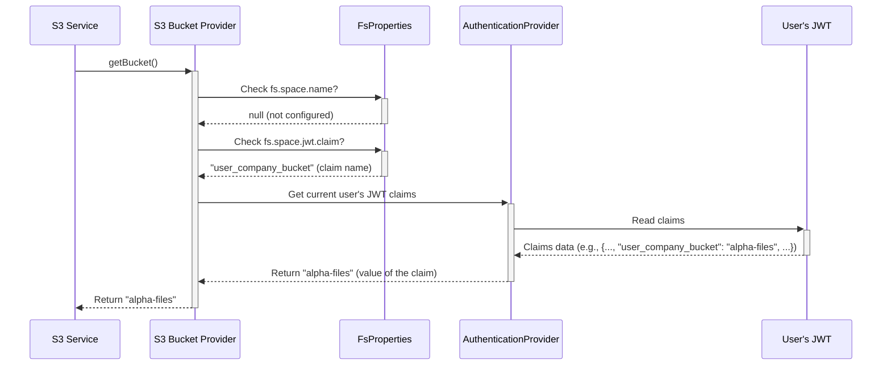

# Chapter 5: S3 Bucket Provider

In [Chapter 4: S3 Service](04_s3_service_.md), we met the "warehouse worker" (`S3Service`) that actually puts files into storage and retrieves them. We saw it takes commands like `putObject` or `statObject` and uses an S3 client library to talk to the storage. But one crucial question remained: how does the `S3Service` know *which specific S3 bucket* (the top-level container) to use?

Imagine a large office building housing many different companies. When you arrive at reception (our [File Endpoint & F2 Functions](01_file_endpoint___f2_functions_.md)) and ask to deliver a package to "Acme Corp", the receptionist needs to know which floor Acme Corp is on. They might look it up in a directory.

The **S3 Bucket Provider** is like that building directory for `connect-fs`. It's a small, focused helper component whose only job is to figure out the correct S3 bucket name for the current operation.

## Why Do We Need a Bucket Provider? Multi-Tenancy!

Why not just always use the same bucket? Sometimes you might want to! But often, especially in systems used by many different customers or groups (this is called "multi-tenancy"), you might want to keep their files separate for security, billing, or organization.

*   **Use Case:** Imagine two different companies, "Alpha Inc." and "Beta Corp.", both using your application, which uses `connect-fs` for file storage. You might want all of Alpha Inc.'s files to go into a bucket named `alpha-files` and all of Beta Corp.'s files into `beta-files`.

When a user from Alpha Inc. uploads a file, the `S3Service` needs to know to use the `alpha-files` bucket. When a user from Beta Corp. uploads, it needs to use `beta-files`. The `S3BucketProvider` handles this decision.

## How Does It Find the Bucket Name?

The `S3BucketProvider` has two primary ways to determine the bucket name:

1.  **From Configuration (Fixed Bucket):** You can simply tell `connect-fs` in its main configuration file ([Chapter 3: Configuration (FsProperties)](03_configuration__fsproperties__.md)) to *always* use a specific bucket name for everyone. This is the simplest setup.

    ```yaml
    # In application.yml
    fs:
      space:
        name: my-shared-files # Everyone uses this bucket
      # ... other fs.s3 settings ...
    ```
    In this case, the `S3BucketProvider` will always return "my-shared-files".

2.  **From User's Token (Dynamic Bucket via JWT):** For multi-tenancy, you can configure `connect-fs` to look inside the user's security token (JWT - JSON Web Token). When a user logs in, they get a token containing information about them. We can put the name of *their* specific bucket inside this token as a piece of data called a "claim".

    ```yaml
    # In application.yml
    fs:
      space:
        # No fixed name here!
        jwt:
          claim: user_company_bucket # Look for this claim in the JWT
      # ... other fs.s3 settings ...
    ```
    Now, if Alice from Alpha Inc. logs in, her JWT might contain `"user_company_bucket": "alpha-files"`. When she uploads a file, the `S3BucketProvider` will extract "alpha-files" from her token. If Bob from Beta Corp. logs in, his token might have `"user_company_bucket": "beta-files"`, and the provider will extract that name instead.

## How It's Used (Internally)

You typically don't interact with the `S3BucketProvider` directly. It's used internally by the [S3 Service](04_s3_service_.md) whenever it needs to perform an operation like uploading, downloading, or listing files.

Remember the `S3Service.putObject` function from the previous chapter? Before it can build the S3 command, it needs the bucket name.

```kotlin
// Simplified from S3Service.kt
class S3Service(
    private val minioClient: MinioClient,
    // The S3Service gets the provider automatically
    private val s3BucketProvider: S3BucketProvider
) {
    suspend fun putObject(path: String, content: ByteArray, metadata: Map<String, String>) {
        // 1. Ask the provider for the bucket name!
        val bucketName = s3BucketProvider.getBucket()

        // 2. Build the S3 command using the bucketName
        val args = PutObjectArgs.builder()
            .bucket(bucketName) // Use the name provided
            .`object`(path)
            // ... other args ...
            .build()

        // 3. Execute the command
        minioClient.putObject(args)
    }
    // ... other functions also call s3BucketProvider.getBucket() ...
}
```
*   The `S3Service` calls `s3BucketProvider.getBucket()` to get the correct bucket name for the current request.
*   It then uses this `bucketName` when interacting with the S3 client library (`minioClient`).

## Under the Hood: The Decision Logic

How does the `getBucket()` function decide which name to return? It follows a specific order:

1.  **Check Fixed Config:** Does the [Configuration (FsProperties)](03_configuration__fsproperties__.md) object have a value set for `fs.space.name`? If yes, return that name immediately.
2.  **Check JWT Config:** If no fixed name, does the `FsProperties` have configuration under `fs.space.jwt.claim`?
    *   If yes, it asks the system's authentication component (`AuthenticationProvider`) for the currently logged-in user's security token (JWT).
    *   It then looks inside that token for the specific claim name configured (e.g., `user_company_bucket`).
    *   If the claim is found in the token and has a value, return that value.
3.  **Check Deprecated Config (Fallback):** If neither of the above worked, it checks for an *older*, less preferred configuration setting (`fs.s3.bucket`). This is mainly for backward compatibility. If found, return that name.
4.  **Error:** If none of the above steps yielded a bucket name, the provider doesn't know where to store the file! It throws a `NoBucketConfiguredError` to signal that the system is misconfigured.

**Sequence Diagram:**

This diagram shows the `S3Service` asking the `S3BucketProvider` for the bucket name, assuming the JWT configuration is used:



**Diving into the Code (`S3BucketProvider.kt`)**

The code for the provider reflects this logic quite directly.

```kotlin
// Simplified from fs-api/api-config/src/main/kotlin/io/komune/fs/api/config/S3BucketProvider.kt
import io.komune.f2.spring.boot.auth.AuthenticationProvider // Helper for JWT info
import io.komune.fs.commons.error.NoBucketConfiguredError
import f2.dsl.cqrs.error.asException

class S3BucketProvider(
    // Gets the loaded configuration properties
    private val fsProperties: FsProperties
) {

    suspend fun getBucket(): String {
        // Try the new ways first (fixed name or JWT claim)
        return getSpace()
            // If that didn't work, try the old deprecated way
            ?: deprecatedBucket()
            // If still nothing, throw an error
            ?: throw NoBucketConfiguredError().asException()
    }

    // Checks fs.space.name OR fs.space.jwt.claim via AuthenticationProvider
    private suspend fun getSpace(): String? {
        return fsProperties.space?.name // Check fixed name first
            ?: AuthenticationProvider.getTenant() // Check JWT claim second
                 // Note: getTenant() looks for the claim specified in fs.space.jwt.claim
    }

    // Checks the old fs.s3.bucket property
    private fun deprecatedBucket(): String? {
        return fsProperties.s3.bucket
    }
}
```
*   The class takes the `FsProperties` (loaded configuration) as input.
*   `getBucket()` orchestrates the checks in the correct order.
*   `getSpace()` handles the primary logic: check the fixed `fs.space.name`, and if that's null, try getting the tenant identifier from the `AuthenticationProvider` (which reads the configured JWT claim).
*   `deprecatedBucket()` checks the old `fs.s3.bucket`.

## Conclusion

You've learned about the `S3BucketProvider`, the simple but crucial component that tells the [S3 Service](04_s3_service_.md) *which* bucket to use. You saw how it supports both simple, fixed-bucket setups (via `fs.space.name` in the [Configuration (FsProperties)](03_configuration__fsproperties_.md)) and complex multi-tenant scenarios by dynamically reading the bucket name from a user's JWT claim (configured via `fs.space.jwt`). This provider ensures that files land in the correct top-level container within your S3 storage.

Sometimes, just storing a file isn't enough. You might want to record *that* a file was uploaded or deleted in a secure, auditable way, perhaps even triggering other automated actions based on these events. How can `connect-fs` integrate with systems designed for event tracking and automation?

Let's explore how `connect-fs` can optionally connect to event sourcing and state machine systems in the next chapter! Ready for automation? Let's move on to [Chapter 6: Event Sourcing / SSM (S2 Automate)](06_event_sourcing___ssm__s2_automate__.md)!

---

Generated by [AI Codebase Knowledge Builder](https://github.com/The-Pocket/Tutorial-Codebase-Knowledge)