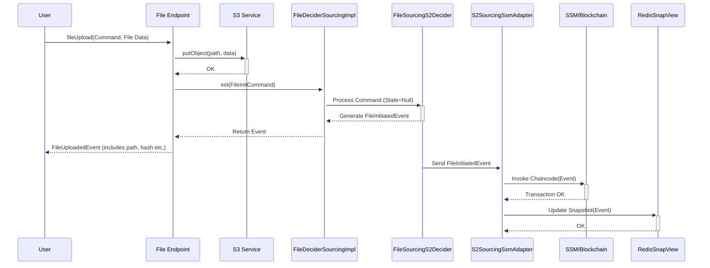

# Chapter 6: Event Sourcing / SSM (S2 Automate)

In [Chapter 5: S3 Bucket Provider](05_s3_bucket_provider_.md), we learned how `connect-fs` determines the correct S3 bucket for storing files, supporting both simple setups and multi-tenant environments. So far, we've focused on the basic actions: putting files in, getting them out, listing them.

But what if you need more than just the current files? What if you need a trustworthy record of *everything* that has happened to a specific file over time? For example, proving when a compliance document was uploaded or confirming it hasn't been tampered with since.

This is where **Event Sourcing** comes in, an optional but powerful feature in `connect-fs`, often implemented using the **S2 framework** and potentially secured with **SSM (Simple State Machine)** on a blockchain.

## The Problem: Needing an Audit Trail

Imagine you're managing important contracts or financial reports using `connect-fs`. Sometimes, just having the latest version isn't enough. You might need to answer questions like:
*   When exactly was this contract first uploaded?
*   Who made the last update (logged a new version)?
*   Was this file ever deleted and then re-uploaded?
*   Can we *prove* this sequence of events happened and hasn't been altered?

Simply looking at the current file in the S3 bucket doesn't give you this history.

## The Solution: Recording Every Action (Event Sourcing)

**Event Sourcing** is like keeping a detailed diary or ledger for each file. Instead of just storing the *current state* of the file (its latest content), we record every significant *action* (or "event") that happens to it.

*   **Analogy:** Think of a notary public. They don't just keep the final version of a document; they keep a logbook recording every time someone signed it, amended it, or even declared it void. Each entry in the logbook is an "event".

In `connect-fs`, these events could be:
*   `FileInitiatedEvent`: A new file was created (uploaded for the first time).
*   `FileLoggedEvent`: An existing file was updated or re-logged (perhaps a new version uploaded, overwriting the old one, but we record that the action happened).
*   `FileDeletedEvent`: A file was deleted.

By storing this sequence of events, we can reconstruct the history of the file at any point in time.

## Powering the Events: The S2 Framework

How do we manage these events and the rules around them? `connect-fs` uses the **S2 framework (S2 Automate)**. S2 helps define the "lifecycle" or "state machine" of a file.

*   **State Machine:** This defines the possible states a file can be in (e.g., `Exists`, `Deleted`) and the events that cause transitions between these states. For instance, a `FileInitiatedEvent` moves the file state to `Exists`, and a `FileDeletedEvent` moves it from `Exists` to `Deleted`.

S2 provides tools to:
1.  Define the allowed states and transitions.
2.  Process commands (like "delete this file").
3.  Validate if the command is allowed in the current state.
4.  Generate the corresponding event if the command is valid.

## Optional Security: Recording Events on Blockchain (SSM)

Recording events is useful, but how can we be *sure* the event log itself hasn't been tampered with? For maximum security and auditability, `connect-fs` can optionally integrate with **SSM (Simple State Machine)**.

*   **SSM:** This is a framework for building applications on top of blockchain technology (like Hyperledger Fabric).
*   **Blockchain:** Think of it as a shared, immutable (unchangeable) digital ledger. Once an event is recorded on the blockchain via SSM, it's extremely difficult to alter or delete it without detection.

If you enable SSM integration in the [Configuration (FsProperties)](03_configuration__fsproperties__.md), the S2 framework will automatically send the generated file events (`FileInitiatedEvent`, `FileDeletedEvent`, etc.) to the configured blockchain channel.

*   **Analogy Revisited:** The notary public (S2) now records their log entries (events) not just in their private book, but stamps them into a secure, public, tamper-proof registry (the blockchain via SSM).

This provides a very high level of trust and traceability, often required for compliance or regulatory purposes.

## How to Use It (Mostly Automatic!)

The beauty of this system is that if event sourcing (and optionally SSM) is configured, you don't need to do much differently!

1.  **Configuration:** You enable the feature and provide SSM details (channel, chaincode, signer) in your `application.yml` file, as covered in [Chapter 3: Configuration (FsProperties)](03_configuration__fsproperties__.md).

    ```yaml
    # In application.yml
    fs:
      ssm:
        channel: my-secure-ledger # Blockchain channel name
        chaincode: file-tracker   # Smart contract name
        signerName: service-account # Identity name for signing
        signerFile: /path/to/signer.creds # Credentials file
      # ... other fs properties ...

    # Spring redis config might also be needed for caching snapshots
    spring:
      redis:
        host: localhost
        port: 6379
    ```

2.  **Normal Operations:** You continue using the standard [File Endpoint & F2 Functions](01_file_endpoint___f2_functions_.md) like `fileUpload` or `fileDelete`.

3.  **Behind the Scenes:**
    *   When you upload a file, `connect-fs` not only saves it using the [S3 Service](04_s3_service_.md) but also generates a `FileInitCommand` or `FileLogCommand`.
    *   The S2 decider processes this command and emits a `FileInitiatedEvent` or `FileLoggedEvent`.
    *   If SSM is enabled, this event is automatically sent to the blockchain.
    *   Similarly, deleting a file generates a `FileDeleteByIdCommand`, leading to a `FileDeletedEvent` being recorded.

**Output: The Events**

The "output" you get from this system isn't usually a direct response, but rather the recorded events themselves, which provide the audit trail. Here's what those events might look like (simplified):

```kotlin
// Event recorded when a file is first uploaded
@Serializable // Can be converted to JSON for storage/blockchain
data class FileInitiatedEvent(
    val id: FileId,       // Unique ID of the file entity
    val path: FilePath,   // Where the file was stored
    val url: String,      // Public URL
    val hash: String,     // Fingerprint of the file content
    val metadata: Map<String, String>, // Extra info
    val time: Long        // When it happened
    // Inherits from FileEvent
)

// Event recorded when a file is deleted
@Serializable
data class FileDeletedEvent(
    val id: FileId,       // Which file entity was deleted
    val path: FilePath    // Original path of the deleted file
    // Inherits from FileEvent
)
```
These events, stored sequentially (potentially on the blockchain), form the complete history of the file.

## Under the Hood: The Event Sourcing Flow

Let's trace what happens when you upload a file and event sourcing/SSM are enabled:

1.  **Request:** User sends `fileUpload` request to [File Endpoint & F2 Functions](01_file_endpoint___f2_functions_.md).
2.  **Storage:** The endpoint calls the [S3 Service](04_s3_service_.md) to save the file.
3.  **Command Creation:** The endpoint (or a related component like `FileDeciderSourcingImpl`) creates a command, e.g., `FileInitCommand`, containing details about the upload.
4.  **S2 Decider:** The command is passed to the `FileSourcingS2Decider`. This component checks the file's current state (if it exists) and the rules defined in the S2 state machine (`S2.traceSourcing`).
5.  **Event Generation:** If the command is valid (e.g., you can initiate a file if it doesn't exist), the decider generates the corresponding event, e.g., `FileInitiatedEvent`.
6.  **SSM Adapter (Optional):** If SSM is configured, the `S2SourcingSsmAdapter` (in `FileSourcingAutomateConfig`) catches this event.
7.  **Blockchain Transaction:** The adapter packages the event, signs it using the configured credentials (`signerAgent`), and sends it as a transaction to the specified SSM chaincode (`chaincodeUri`) on the blockchain.
8.  **View Update:** The event is also used by a `View` component (like `FileModelView`) to update a local, read-optimized representation of the file's state (often cached, e.g., in Redis via `RedisSnapView`). This cache helps quickly know the current state without replaying all events.

**Sequence Diagram:**


*(Note: The SSM/Cache update often happens asynchronously or as part of the S2 processing flow).*

## Diving Deeper into the Code

Let's look at the key code pieces involved:

**1. Configuration (`FsSsmConfig.kt`)**

This class loads the `fs.ssm.*` properties from `application.yml`.

```kotlin
// From fs-s2/file/fs-file-app/src/main/kotlin/io/komune/fs/s2/file/app/config/FsSsmConfig.kt
@ConfigurationProperties(prefix = "fs.ssm") // Reads properties starting with fs.ssm
class FsSsmConfig(
    val channel: String,     // -> fs.ssm.channel
    val chaincode: String,   // -> fs.ssm.chaincode
    val signerName: String,  // -> fs.ssm.signerName
    val signerFile: String,  // -> fs.ssm.signerFile
    // Optional: Only apply SSM logic for specific directories
    val directories: List<String>?
)
```
This makes the blockchain connection details available to the application.

**2. Defining the State Machine (`S2File.kt`)**

This uses S2's Kotlin DSL (`s2Sourcing`) to define the file lifecycle.

```kotlin
// From fs-s2/file/fs-file-domain/src/commonMain/kotlin/io/komune/fs/s2/file/domain/automate/S2File.kt
object S2 {
	val traceSourcing = s2Sourcing { // Defines the state machine
		name = "FileSourcing"
		// Rule: FileInitCommand transitions TO Exists state
		transaction<FileInitCommand, FileInitiatedEvent> {
			to = FileState.Exists
			role = FileRole.Tracer // Who can perform this
		}
		// Rule: FileDeleteByIdCommand transitions FROM Exists TO Deleted state
		transaction<FileDeleteByIdCommand, FileDeletedEvent> {
			from = FileState.Exists
			to = FileState.Deleted
			role = FileRole.Tracer
		}
		// Rule: FileLogCommand can happen when state IS Exists (stays Exists)
		selfTransaction<FileLogCommand, FileLoggedEvent> {
			states += FileState.Exists // Must be in Exists state
			role = FileRole.Tracer
		}
	}
}
```
This clearly defines the allowed events and state changes for files.

**3. The Decider Implementation (`FileDeciderSourcingImpl.kt`)**

This class acts as an entry point, taking commands and using the S2 decider.

```kotlin
// From fs-s2/file/fs-file-app/src/main/kotlin/io/komune/fs/s2/file/app/FileDeciderSourcingImpl.kt
@Service
class FileDeciderSourcingImpl(
	private val decider: FileSourcingS2Decider // The core S2 logic component
	// ... other dependencies like S3Properties ...
): FileDecider { // Implements the domain interface

	// Handle the 'init' command
	override suspend fun init(cmd: FileInitCommand): FileInitiatedEvent = decider.init(cmd) {
		// This block defines HOW to create the event if the command is valid
		FileInitiatedEvent(id = cmd.id, path = cmd.path, /*... other fields ...*/)
	}

	// Handle the 'log' command (update)
	override suspend fun log(cmd: FileLogCommand): FileLoggedEvent = decider.transition(cmd) { file ->
		// 'file' is the current state from the cache/snapshot
		FileLoggedEvent(id = file.id, path = FilePath.from(cmd.path), /*...*/)
	}

	// Handle the 'delete' command
	override suspend fun delete(cmd: FileDeleteByIdCommand): FileDeletedEvent = decider.transition(cmd) { file ->
		FileDeletedEvent(id = file.id, path = /* build path from file state */)
	}
}
```
It translates incoming requests into S2 commands (`init`, `transition`) and defines how to construct the resulting event.

**4. Connecting S2 to SSM (`FileSourcingAutomateConfig.kt`)**

This configuration class wires everything together.

```kotlin
// From fs-s2/file/fs-file-app/src/main/kotlin/io/komune/fs/s2/file/app/config/FileSourcingAutomateConfig.kt
@Configuration
// Adapter that links S2 events to SSM blockchain transactions
class FileSourcingAutomateConfig(
    private val fsSsmConfig: FsSsmConfig, // Loaded SSM properties
    redisSnapView: RedisSnapView,         // Cache for current state
    traceS2Decider: FileSourcingS2Decider // The S2 decision logic
): S2SourcingSsmAdapter<FileEntity, FileState, FileEvent, FileId, FileSourcingS2Decider>(
	executor = traceS2Decider, // Use this S2 decider
	view = FileModelView(),    // How to update the local view
	snapRepository = redisSnapView // Where to cache the state
) {
	// ... configure JSON serialization for events ...

	// Tell the adapter WHERE on the blockchain to send events
	override fun chaincodeUri() = ChaincodeUri.from(
        channelId = fsSsmConfig.channel,
        chaincodeId = fsSsmConfig.chaincode
    )
	// Tell the adapter WHO is sending the transaction (for signing)
	override fun signerAgent() = Agent.loadFromFile(
        fsSsmConfig.signerName, fsSsmConfig.signerFile
    )
	// Link to the S2 state machine definition
	override fun automate() = S2.traceSourcing
}
```
This crucial piece connects the S2 event stream to the specific blockchain channel and chaincode defined in the configuration, using the provided signer credentials.

## Conclusion

You've learned about the optional **Event Sourcing** feature in `connect-fs`, powered by the **S2 Automate** framework. This allows you to maintain a detailed, sequential log of every important action (creation, update/log, deletion) performed on a file. When combined with **SSM (Simple State Machine)**, these events can be immutably recorded on a blockchain, providing a highly secure and auditable history, perfect for compliance and traceability needs. While powerful, this feature works largely behind the scenes once configured, enhancing standard file operations with a robust audit trail.

So far, we've treated files mostly as opaque blobs of data. But what if the *content* of the files holds valuable information we want to search or analyze? How can `connect-fs` help unlock the knowledge within your files?

Let's explore how `connect-fs` can integrate with knowledge bases and vectorization techniques in the final chapter! Ready to index file content? Let's proceed to [Chapter 7: Knowledge Base / Vectorization (KB)](07_knowledge_base___vectorization__kb_.md)!

---

Generated by [AI Codebase Knowledge Builder](https://github.com/The-Pocket/Tutorial-Codebase-Knowledge)