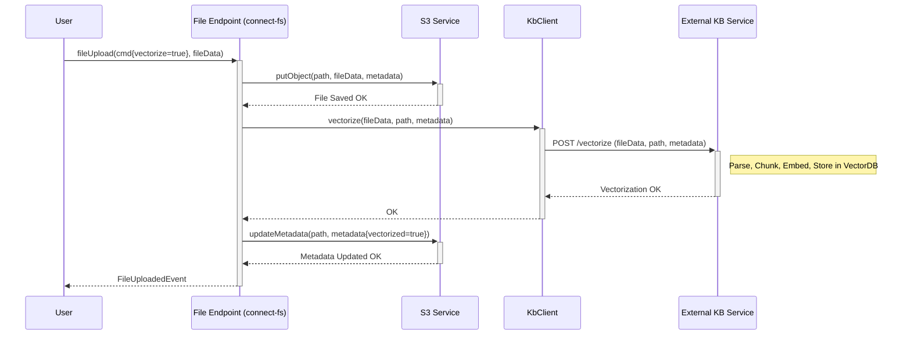
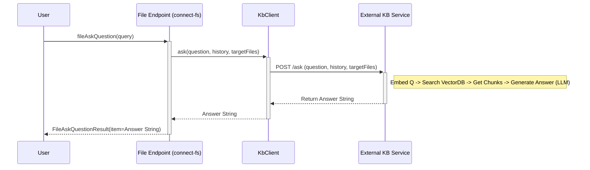

# Chapter 7: Knowledge Base / Vectorization (KB)

Welcome to the final chapter! In [Chapter 6: Event Sourcing / SSM (S2 Automate)](06_event_sourcing___ssm__s2_automate__.md), we explored how `connect-fs` can optionally keep a secure audit trail of file activities using event sourcing and blockchain integration. That helps track the *history* of files, but what about the *content* inside them?

Imagine you've uploaded dozens of project reports, research papers, or meeting notes into `connect-fs`. Searching for them by filename is easy, but finding specific information *within* those documents can be like searching for a needle in a haystack. What if you could just *ask* questions about the content, like "What were the main conclusions of the Q2 market analysis?" or "Summarize the risks discussed in the project X reports"?

This is where the optional **Knowledge Base / Vectorization (KB)** feature comes in. It allows `connect-fs` to integrate with a specialized service that understands the *meaning* of the text inside your files, enabling powerful semantic search and question-answering.

## The Challenge: Searching Inside Files

Traditional file systems let you search for files by name, date, or maybe even simple keywords *if* the system specifically indexes them. But they usually don't understand the *meaning* or *context* of the words. A search for "apple" won't find documents talking about "fruit" unless the word "apple" is explicitly there.

## The Solution: Teaching Files to "Understand"

The KB feature tackles this by transforming the text content of your files into a format that captures semantic meaning. This process involves a few key ideas:

1.  **Vectorization (or Embedding):** This is the core magic. Text from your files (like paragraphs or sentences) is fed into a sophisticated AI model (an "embedding model"). This model converts the text into a list of numbers, called a **vector**. The crucial part is that texts with similar meanings will have vectors that are mathematically "close" to each other in a high-dimensional space.
    *   *Analogy:* Imagine a giant library map where books aren't just alphabetical but placed close together based on their topics. A book about "apples" would be near books about "pears," "fruit," and maybe even "healthy eating," even if they don't share the exact same words. Vectorization creates the coordinates for each piece of text on this "meaning map."

2.  **Vector Store:** Once you have these vectors, you need a special place to store them along with the original text they represent. This is a **vector store** (or vector database). It's designed specifically for efficiently searching these numerical vectors based on their "closeness."
    *   *Analogy:* This is the specialized shelving system and index for our meaning-based library map, allowing the librarian to quickly find all items in the "fruit cultivation" section.

3.  **Semantic Search:** With text converted to vectors and stored, you can now search based on meaning. When you ask a question, your question is *also* converted into a vector. The system then searches the vector store for the text chunks whose vectors are closest to your question's vector.
    *   *Analogy:* You ask the librarian, "Tell me about growing apples." The librarian translates your request onto the meaning map and finds the books and articles located closest to that point, even if they use terms like "orchards," "pomology," or "Malus domestica."

4.  **Knowledge Base (KB):** This term encompasses the entire system: the vectorized content stored in the vector store, ready to be queried. It's the foundation that allows for asking natural language questions.

5.  **Question Answering (QA):** Often, semantic search is combined with another AI model (like GPT, a Large Language Model or LLM). The system finds the most relevant text chunks using semantic search and then feeds these chunks, along with your original question, to the LLM to synthesize a coherent, natural language answer.

## Integrating with `connect-fs`: The `KbClient`

How does `connect-fs` make use of this? It doesn't perform the complex AI tasks itself. Instead, it relies on an **external KB service** (which includes the vector store, embedding models, and potentially an LLM).

The bridge between `connect-fs` and this external service is the **`KbClient`**.

*   **`KbClient`:** This component, configured within `connect-fs`, knows how to talk to the external KB service (usually via web requests). It handles sending file content for vectorization and sending questions to get answers.
    *   *Analogy:* `KbClient` is the dedicated phone line and translator that lets the `connect-fs` librarian communicate with a specialized "Research Assistant AI" service.

## How to Use the KB Feature

Using the KB feature involves two main steps: getting your file content vectorized and then asking questions.

**Step 1: Vectorizing Files**

You need to tell the system which files should be part of the knowledge base.

*   **Option A: During Upload:** When uploading a file using the [File Endpoint & F2 Functions](01_file_endpoint___f2_functions_.md), you can set the `vectorize` flag to `true` in the `FileUploadCommand`.

    ```kotlin
    // Example: Uploading 'report.pdf' and vectorizing it
    val uploadCommand = FileUploadCommand(
        path = FilePath(
            objectType = "project",
            objectId = "proj-alpha",
            directory = "reports",
            name = "report.pdf"
        ),
        metadata = mapOf("reportType" to "Q3 Analysis"),
        vectorize = true // <<< Tell the system to vectorize this file!
    )
    // ... plus the actual file data for report.pdf ...
    ```
    When `connect-fs` processes this, after saving the file to S3, it will use the `KbClient` to send the content of `report.pdf` to the external KB service for vectorization and storage.

*   **Option B: After Upload:** If a file is already stored, you can use the `FileVectorizeCommand`.

    ```kotlin
    // Example: Vectorizing an already existing file
    val vectorizeCommand = FileVectorizeCommand(
        path = FilePath(
            objectType = "project",
            objectId = "proj-alpha",
            directory = "reports",
            name = "existing_notes.txt"
        ),
        metadata = mapOf("source" to "meeting") // Optional metadata for chunks
    )
    // Send this command to the fileVectorize function
    ```
    This tells `connect-fs` to fetch the content of `existing_notes.txt` from S3 and send it via `KbClient` for vectorization.

**Step 2: Asking Questions**

Once files are vectorized, you can ask questions about their content using the `FileAskQuestionFunction`.

```kotlin
// Example: Asking a question about specific project reports
val askQuery = FileAskQuestionQuery(
    question = "What were the key risks identified in the Q3 reports?",
    history = emptyList(), // Provide previous messages for conversational context
    metadata = FileAskMetadata(
        // Tell the KB which files to focus on (using their IDs/paths)
        targetedFiles = listOf(
            "project/proj-alpha/reports/report.pdf",
            "project/proj-beta/reports/q3_summary.docx"
            // Can target multiple files, even across different objects/dirs
        )
    )
)

// Send this query to the fileAskQuestion function...
// ...and receive a result like:
val askResult = FileAskQuestionResult(
    item = "The key risks identified include market volatility impacting raw material costs (report.pdf, page 5) and potential delays in component delivery from supplier X (q3_summary.docx, section 3.2)."
)
```
*   You provide your natural language question.
*   You can optionally provide conversation history for follow-up questions.
*   You specify which files (`targetedFiles`) the question relates to. The KB service will limit its search to the vectorized content of these specific files.
*   The system returns a synthesized answer in the `item` field of the `FileAskQuestionResult`.

## Under the Hood: How It Works

Let's trace the flow for both vectorization (during upload) and asking a question.

**Vectorization Flow (Simplified)**

1.  **Request:** User sends `fileUpload` with `vectorize=true`.
2.  **Storage:** [File Endpoint & F2 Functions](01_file_endpoint___f2_functions_.md) tells [S3 Service](04_s3_service_.md) to save the file.
3.  **KB Call:** `FileEndpoint` uses `KbClient` to send the file's content, path, and metadata to the external KB service (likely invoking something like `VectorCreateFunction` endpoint on the KB service).
4.  **External KB Service:**
    *   Receives the file content.
    *   Parses the text (e.g., extracts text from PDF).
    *   Splits the text into smaller chunks (e.g., paragraphs).
    *   Generates a vector (embedding) for each chunk using an AI model.
    *   Stores the chunks and their vectors in the vector store (e.g., ChromaDB).
5.  **Confirmation:** External KB service confirms success to `KbClient`.
6.  **(Optional) Metadata Update:** `FileEndpoint` might update the file's metadata in S3 (using `S3Service`) to mark it as `vectorized=true`.
7.  **Response:** `FileEndpoint` returns `FileUploadedEvent` to the user.



**Question-Answering Flow (Simplified)**

1.  **Request:** User sends `FileAskQuestionQuery` to `fileAskQuestion` function.
2.  **KB Call:** `FileEndpoint` uses `KbClient` to call the `knowledgeAsk` (`VectorAskFunction`) endpoint on the external KB service, sending the question, history, and target file paths.
3.  **External KB Service:**
    *   Generates a vector for the user's question.
    *   Searches the vector store for text chunks from the `targetedFiles` whose vectors are closest to the question vector.
    *   Retrieves the text of these relevant chunks.
    *   (If using LLM) Sends the original question and the retrieved chunks to an LLM (like GPT).
    *   LLM synthesizes an answer based on the provided context.
4.  **Response:** External KB service returns the generated answer string to `KbClient`.
5.  **Result:** `KbClient` passes the answer back to `FileEndpoint`.
6.  **Return:** `FileEndpoint` returns `FileAskQuestionResult` containing the answer to the user.



## Diving into the Code

*   **`KbClient` (`fs-kb-client/.../KbClient.kt`):** This class uses the `F2Client` (a web client library) to make HTTP requests to the configured external KB service URL. It defines functions like `knowledgeAsk` and `vectorCreateFunction` which map to specific endpoints (`/ask`, `/`) on the KB service.

    ```kotlin
    // Simplified from KbClient.kt
    open class KbClient(val client: F2Client) { // Gets an HTTP client

        // Function to ask a question
        fun knowledgeAsk(): VectorAskFunction = F2Function { msgs ->
            msgs.map { cmd -> // For each query
                // Use the HTTP client to POST to the /ask endpoint
                val responseJson: String = (client as HttpF2Client).httpClient.post(
                   "${client.urlBase}/ask"
                ) {
                    // Set headers and the JSON body (question, history, targets)
                    setBody( /* build JSON from cmd */)
                }.body() // Get the response body (the answer string)

                VectorAskedEventDTOBase(responseJson) // Wrap the answer string
            }
        }

        // Function to send a file for vectorization
        fun vectorCreateFunction(): VectorCreateFunction = F2Function { msgs ->
            msgs.map { cmd -> // For each command
                // Use the HTTP client to POST form data (file + metadata) to the base URL
                (client as HttpF2Client).httpClient.submitFormWithBinaryData(
                    url = client.urlBase,
                    formData = /* build form data from cmd (path, metadata, file bytes) */
                ).body() // No specific event data needed, just success/failure
            }
        }
    }
    ```
    This client handles the low-level communication details.

*   **`FileEndpoint` (`fs-file-app/.../FileEndpoint.kt`):** This is where the `KbClient` is actually used.

    ```kotlin
    // Simplified snippets from FileEndpoint.kt
    class FileEndpoint(...) { // Dependencies like KbClient are injected

        @Autowired(required = false) // KB is optional
        private lateinit var kbClient: KbClient

        // Inside fileUpload function:
        suspend fun fileUpload(cmd: FileUploadCommand, file: FilePart): FileUploadedEvent {
            // ... save file to S3 ...
            val fileByteArray = file.contentByteArray()

            // If vectorization is requested...
            if (cmd.vectorize ?: false) {
                // Call the local helper function
                vectorize(cmd.path, cmd.metadata, fileByteArray)
            }
            // ... return FileUploadedEvent ...
        }

        // Helper function to call KbClient for vectorization
        private suspend fun vectorize(path: FilePath, metadata: Map<String, String>, fileByteArray: ByteArray) {
            logger.debug("Vectorizing file $path")
            // Create the command DTO for the KbClient
            val vectorCmd = VectorCreateCommandDTOBase(
                path = path, file = fileByteArray, metadata = metadata
            )
            // Invoke the function on KbClient
            vectorCmd.invokeWith(kbClient.vectorCreateFunction())

            // Mark file as vectorized in S3 (simplified)
            s3Service.updateMetadata(path.toString(), mapOf("vectorized" to "true"))
            logger.debug("File $path vectorized")
        }

        // The fileAskQuestion function:
        @Bean
        fun fileAskQuestion(): FileAskQuestionFunction = f2Function { query ->
            logger.info("fileAskQuestion: $query")
            // Create the query DTO for KbClient
            val askCmd = VectorAskQueryDTOBase(
                question = query.question,
                targetedFiles = query.metadata.targetedFiles, // Use file paths/IDs
                history = query.history
            )
            // Invoke the function on KbClient
            val resultEvent = askCmd.invokeWith(kbClient.knowledgeAsk())
            // Wrap the result string
            FileAskQuestionResult(resultEvent.item)
        }
    }
    ```
    The endpoint orchestrates the process: saving the file, calling `KbClient` if needed, and handling user queries by forwarding them to `KbClient`.

*   **External KB Service (`infra/docker-compose/docker-compose-kb.yml`):** The `docker-compose-kb.yml` file shows how a separate Docker container (`kb-api`) can be run to provide this service. It typically uses libraries like LangChain or LlamaIndex, embedding models (like those from OpenAI or open-source ones), a vector store (like ChromaDB, Pinecone, Weaviate), and potentially an LLM (like GPT-3.5/4 or open-source models) to perform the actual KB tasks. `connect-fs` just needs to know its URL.

*   **Data Transfer Objects (DTOs):** Files like `VectorAskFunction.kt`, `VectorCreateFunction.kt`, `FileAskQuestionQuery.kt`, `FileVectorizeCommand.kt` define the structure of the data exchanged between `connect-fs` and the `KbClient`/external KB service (questions, file paths, answers, metadata).

## Conclusion

Congratulations! You've reached the end of the `connect-fs` tutorial. In this final chapter, you learned about the powerful but optional **Knowledge Base / Vectorization (KB)** feature. By integrating with an external KB service via the **`KbClient`**, `connect-fs` allows you to unlock the information *within* your files. Through **vectorization**, file content is transformed into a searchable format based on semantic meaning, stored in a **vector store**. This enables you to perform **semantic searches** and ask natural language questions about your documents using functions like **`FileAskQuestionFunction`**, making `connect-fs` not just a file storage system, but potentially a knowledge discovery tool.

We hope this tutorial has given you a clear understanding of the core concepts in `connect-fs`, from the basics of file operations with the [File Endpoint & F2 Functions](01_file_endpoint___f2_functions_.md) and [FilePath](02_filepath_.md), through configuration with [Configuration (FsProperties)](03_configuration__fsproperties__.md), interaction with storage via the [S3 Service](04_s3_service_.md) and [S3 Bucket Provider](05_s3_bucket_provider_.md), adding auditability with [Event Sourcing / SSM (S2 Automate)](06_event_sourcing___ssm__s2_automate__.md), and finally unlocking content with the Knowledge Base feature. Happy coding!

---

Generated by [AI Codebase Knowledge Builder](https://github.com/The-Pocket/Tutorial-Codebase-Knowledge)