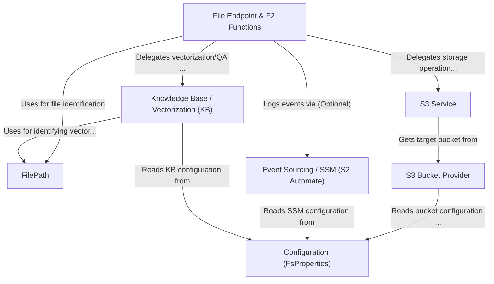

# Tutorial: connect-fs

The `connect-fs` project provides a service for managing **files**.
It acts as an interface to an *S3-compatible storage* (like MinIO), allowing users to upload, download, list, and delete files using a structured **FilePath**.
Optionally, it can track file history using *event sourcing* (via S2 Automate/SSM) for audit trails.
Another optional feature is integrating with a *Knowledge Base* to vectorize file content, enabling semantic search and question-answering on documents.
Configuration, including S3 credentials and optional features, is managed through `FsProperties`.

**Source Repository:** [https://github.com/komune-io/connect-fs](https://github.com/komune-io/connect-fs)

## Chapters

1. [File Endpoint & F2 Functions
](01_file_endpoint___f2_functions_.md)
2. [FilePath
](02_filepath_.md)
3. [Configuration (FsProperties)
](03_configuration__fsproperties__.md)
4. [S3 Service
](04_s3_service_.md)
5. [S3 Bucket Provider
](05_s3_bucket_provider_.md)
6. [Event Sourcing / SSM (S2 Automate)
](06_event_sourcing___ssm__s2_automate__.md)
7. [Knowledge Base / Vectorization (KB)
](07_knowledge_base___vectorization__kb__.md)

---

Generated by [AI Codebase Knowledge Builder](https://github.com/The-Pocket/Tutorial-Codebase-Knowledge)