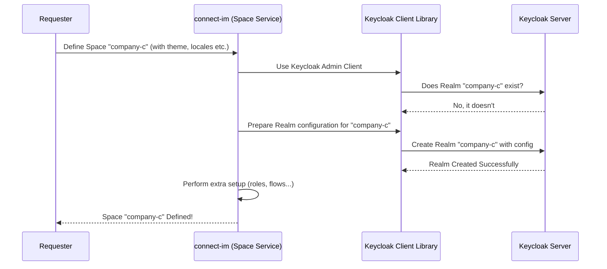

# Chapter 1: Spaces (Keycloak Realms)

Welcome to the `connect-im` tutorial! We're excited to guide you through the core concepts of this powerful identity management tool. Let's start with the foundational concept: **Spaces**.

## What Problem Do "Spaces" Solve?

Imagine you're building a software service (like a project management tool or an online shop platform) that you want to offer to many different companies (or "tenants"). Each company needs its own users, branding, and specific login rules (maybe one company wants stricter password policies or requires Two-Factor Authentication).

How do you keep all these companies separate and secure within your single application? Managing this separation manually would be complex and error-prone.

This is where **Spaces** in `connect-im` come in!

## Introducing Spaces: Your Isolated Environments

In `connect-im`, a **Space** is like a dedicated, private section within the larger identity management system. Think of `connect-im` (powered by Keycloak) as a large office building. A **Space** is like a customizable office suite within that building.

*   **Isolation:** Each Space is completely separate from others. Users in "Company A's Space" cannot log into "Company B's Space" unless explicitly allowed.
*   **Customization:** Each Space can have its own:
    *   **Users:** Its own directory of employees (users).
    *   **Applications (Clients):** Which specific apps (like your project tool's web interface or mobile app) belong to this Space.
    *   **Roles & Permissions:** What different users can *do* within that Space (e.g., "Admin", "Editor", "Viewer"). We'll cover this more in [Chapter 3: Privilege Management (Roles, Permissions, Features)](03_privilege_management__roles__permissions__features__.md).
    *   **Look & Feel (Themes):** Custom login pages, emails, etc., matching the tenant's branding.
    *   **Login Rules:** Specific authentication policies, like requiring Multi-Factor Authentication (MFA) or setting password complexity rules.

Technically, a `connect-im` Space is an abstraction layer on top of a **Keycloak Realm**. Keycloak is the powerful open-source identity and access management solution running under the hood. `connect-im` makes working with these Realms much simpler by calling them "Spaces".

## How Do We Use Spaces?

Let's say you want to onboard "Company C" onto your platform. You would create a new Space for them.

In `connect-im`, you typically define a Space using a command structure. While the actual API call might look different (we'll see more in [Chapter 2: F2 Functions (API Layer)](02_f2_functions__api_layer__.md)), the core information needed is represented by something like `SpaceDefineCommand`.

Here's a conceptual idea of the information you'd provide:

```kotlin
// Simplified concept of defining a space
val command = SpaceDefineCommand(
    identifier = "company-c-space", // A unique ID for the space
    displayName = "Company C Portal", // How the name appears
    theme = "company-c-theme",      // Custom look and feel
    locales = listOf("en", "de"),    // Supported languages
    // ... other settings like SMTP for emails, MFA requirements
)

// This command would then be sent to connect-im to create the space
spaceAggregateService.define(command)
```

This command tells `connect-im`: "Create (or update) an isolated environment named 'company-c-space', make it look like 'company-c-theme', support English and German, and call it 'Company C Portal'."

The result is a defined `Space` object, which might look something like this conceptually:

```kotlin
// Simplified representation of the created space data
data class Space(
    val identifier: String, // "company-c-space"
    val displayName: String?, // "Company C Portal"
    val theme: String?,       // "company-c-theme"
    val locales: List<String>?, // ["en", "de"]
    // ... other properties
)
```

This `Space` object confirms the details of the newly created or updated isolated environment.

## Under the Hood: How Space Creation Works

When you ask `connect-im` to define a Space (like using the `SpaceDefineCommand`), several things happen behind the scenes:

1.  **Authentication:** `connect-im` first checks if you have the permission to create/modify Spaces (this usually requires special administrative rights in the main 'master' space).
2.  **Check Existence:** It asks Keycloak if a Realm with the identifier (e.g., "company-c-space") already exists.
3.  **Create or Update:**
    *   **If it doesn't exist:** `connect-im` tells Keycloak to create a new Realm, configuring it with the details you provided (name, theme, locales, basic security settings).
    *   **If it exists:** `connect-im` tells Keycloak to update the existing Realm with any new details from your command.
4.  **Additional Setup:** `connect-im` might perform extra steps like setting up default client roles, enabling specific Keycloak features, or configuring custom login flows (like MFA) if requested.
5.  **Confirmation:** `connect-im` signals that the Space has been successfully defined.

Here's a simplified diagram showing the interaction:



Let's look at a tiny piece of the code that handles this logic in `SpaceAggregateService.kt`:

```kotlin
// Simplified snippet from SpaceAggregateService.kt

suspend fun define(command: SpaceDefineCommand): SpaceDefinedEvent {
    // ... authentication check (omitted) ...
    logger.info("Defining space: ${command.identifier}")
    try {
        // Try to update existing realm
        update(command)
    } catch (e: jakarta.ws.rs.NotFoundException) {
        // If not found, create a new one
        logger.info("Space not found, creating new: ${command.identifier}")
        create(command)
    }
    // ... configure MFA flows if needed (omitted) ...
    return SpaceDefinedEvent(identifier = command.identifier)
}

private suspend fun create(command: SpaceDefineCommand) {
    val client = keycloakClientProvider.get() // Get Keycloak admin client
    // Prepare RealmRepresentation object with settings
    val realm = RealmRepresentation()
        .applyBaseConfig() // Apply default settings
        .applyCommand(command) // Apply settings from your command

    // Tell Keycloak to create it!
    client.realms().create(realm)
    logger.info("Realm created for space: ${command.identifier}")
    // ... additional setup (omitted) ...
}
```

*   `define`: This function orchestrates the process. It tries to `update` first, and if that fails (because the Realm doesn't exist), it calls `create`.
*   `create`: This function gets a connection to Keycloak (`keycloakClientProvider.get()`), prepares the configuration data (`RealmRepresentation`), and then calls Keycloak's API (`client.realms().create(realm)`) to actually build the Realm.

Similarly, finding information about an existing Space involves asking Keycloak for the Realm's details, as seen in `SpaceFinderService.kt`:

```kotlin
// Simplified snippet from SpaceFinderService.kt

suspend fun getOrNull(id: SpaceIdentifier): Space? {
    val client = keycloakClientProvider.get() // Get Keycloak admin client
    return try {
        // Ask Keycloak for the realm details
        val realmRepresentation = client.realm(id).toRepresentation()
        // Convert Keycloak's data into connect-im's Space object
        realmRepresentation.toSpace()
    } catch (e: jakarta.ws.rs.NotFoundException) {
        null // Return null if Keycloak says it doesn't exist
    }
}
```

This code simply asks Keycloak (`client.realm(id).toRepresentation()`) for the data about the Realm identified by `id` and converts it into the `Space` format used within `connect-im`.

You'll also find scripts like `SpaceConfigScript.kt` and `SpaceCreateScript.kt` in the project. These are powerful tools that *use* the `SpaceAggregateService` and `SpaceFinderService` (among others) to automate the creation and configuration of Spaces based on definition files. We'll touch more on these in [Chapter 6: Configuration & Initialization Scripts](06_configuration___initialization_scripts__.md).

## Conclusion

You've learned the fundamental concept of **Spaces** in `connect-im`. They are isolated environments, mapped to Keycloak Realms, crucial for scenarios like multi-tenancy. Each Space provides a separate container for users, applications, roles, themes, and authentication rules. We saw how `connect-im` abstracts the underlying Keycloak complexity, allowing you to define and manage these environments more easily.

Now that we understand these containers (Spaces), how do we actually *interact* with them and the features inside them? That's where our next topic comes in.

Let's move on to [Chapter 2: F2 Functions (API Layer)](02_f2_functions__api_layer__.md) to see how `connect-im` exposes its capabilities through a structured API layer.

---

Generated by [AI Codebase Knowledge Builder](https://github.com/The-Pocket/Tutorial-Codebase-Knowledge)