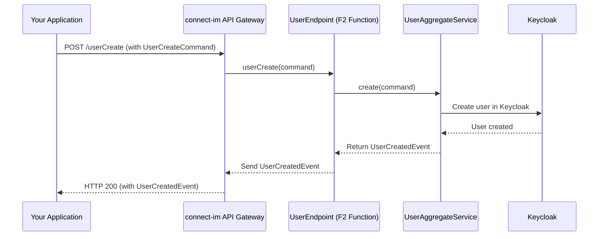

# Chapter 2: F2 Functions (API Layer)

Welcome back! In [Chapter 1: Spaces (Keycloak Realms)](01_spaces__keycloak_realms__.md), we learned about **Spaces** – your isolated environments within `connect-im`. Think of them as individual, secure office suites for different companies or projects.

Now, you might be wondering: "Great, I have these office suites (Spaces). But how do I actually *do* things in them? How do I add an employee (a user), or find out information about a company (an organization)?" This is where **F2 Functions** come into play!

## The Problem: How Do We "Talk" to `connect-im`?

Imagine you're at a very large customer service center. You have many different needs:
*   You might want to register a new product.
*   You might want to ask for details about an existing order.
*   You might want to update your address.

If there was only one giant desk for *everything*, it would be chaotic! You'd wait in a long line, and the person at the desk might not be specialized in what you need.

`connect-im` has many capabilities: creating users, managing organizations, handling permissions, and much more. We need an organized way to ask it to perform these actions or give us information.

## Introducing F2 Functions: Your Specialized Service Desks

**F2 Functions** are the primary way `connect-im` exposes its functionalities. Think of them as specialized customer service desks in our large organization analogy.

*   **User Desk:** Handles requests related to users (e.g., "Create a new user," "Get details for this user ID").
*   **Organization Desk:** Handles requests for organizations (e.g., "Register a new organization," "List all organizations").
*   **API Key Desk:** Handles requests for API keys (e.g., "Create an API key for this organization").

Each "desk" (F2 Function) is designed to handle specific types of requests. This keeps things organized, efficient, and makes it clear where to go for what you need. These F2 Functions form the main **public Application Programming Interface (API)** of the `connect-im` system.

This approach is inspired by a pattern called **Command/Query Responsibility Segregation (CQRS)**. Don't worry too much about the fancy name! It simply means we often have two types of "desks":
1.  **Command Desks:** These desks handle *actions* or *changes*. For example, "Create a user" is a **command** because it changes the system's state by adding a new user.
2.  **Query Desks:** These desks provide *information*. For example, "Get user details" is a **query** because it retrieves data without changing anything.

## How to Use F2 Functions: An Example

Let's say we want to **create a new user** within a Space we've already set up.

1.  **Prepare Your Request (The Command):**
    You need to tell `connect-im` the details of the user you want to create. This is done by preparing a "command" object. Conceptually, it might look like this:

    ```kotlin
    // This isn't actual code you'd write directly in a simple script,
    // but represents the information you'd send.
    val createUserCommand = UserCreateCommand(
        email = "ada.lovelace@example.com",
        givenName = "Ada",
        familyName = "Lovelace",
        roles = listOf("developer"), // Assign her a role
        memberOf = "some-organization-id" // Which organization she belongs to
        // ... other optional details like a password
    )
    ```
    This `UserCreateCommand` is like filling out a form at the "User Creation Desk." It contains all the necessary information.

2.  **Go to the Right "Desk" (Call the F2 Function):**
    You then send this command to the specific F2 Function responsible for creating users. In `connect-im`, this would be something like `userCreate()`.

3.  **Get a Confirmation (The Result/Event):**
    If everything goes well, `connect-im` will create the user and usually send back a confirmation, often called an "event." This event tells you that the action was successful and might include details like the new user's ID.

    ```kotlin
    // Conceptual result from creating a user
    data class UserCreatedEvent(
        val id: String, // e.g., "a1b2c3d4-e5f6-..."
        val email: String // "ada.lovelace@example.com"
    )
    ```
    This is like getting a receipt or a confirmation number from the service desk.

So, if you want to create an organization, you'd use an `OrganizationCreateCommand` and send it to the `organizationCreate()` F2 Function. If you want to get details about an existing organization, you'd use an `OrganizationGetQuery` (or similar) and send it to the `organizationGet()` F2 Function.

## Structure of F2 Functions in `connect-im`

In `connect-im`, F2 functions are typically organized into "domain" modules like `user`, `organization`, `space`, `privilege`, `apikey`, etc.

*   **Domain API Definition:** For each domain, there's often an interface defining what functions are available. For example, `UserApi.kt` might define all user-related F2 functions.

    ```kotlin
    // Simplified from im-f2/user/im-user-domain/src/commonMain/kotlin/io/komune/im/f2/user/domain/UserApi.kt
    interface UserCommandApi {
        /** Create a User */
        fun userCreate(): UserCreateFunction
        /** Update a User */
        fun userUpdate(): UserUpdateFunction
        // ... other user commands
    }

    interface UserQueryApi {
        /** Fetch a User by its ID */
        fun userGet(): UserGetFunction
        // ... other user queries
    }
    ```
    This tells you what "services" the "User Desk" offers (`UserCreateFunction`, `UserGetFunction`, etc.).

*   **Endpoint Implementation:** Then, there's an "Endpoint" class that actually provides these functions as callable services over the network (e.g., HTTP).

    ```kotlin
    // Simplified from im-f2/user/im-user-api/src/main/kotlin/io/komune/im/f2/user/api/UserEndpoint.kt
    @RestController // Marks this as a web API endpoint
    class UserEndpoint(
        private val userAggregateService: UserAggregateService, // The backend logic
        // ... other services like policy enforcers
    ): UserApi { // Implements the defined UserApi

        @Bean // Makes this function discoverable by the F2 framework
        override fun userCreate(): UserCreateFunction = f2Function { command ->
            // 1. Log the request (optional)
            logger.info("userCreate: $command")
            // 2. Check permissions (Simplified - see Chapter 5)
            // policiesEnforcer.checkCreate(command.memberOf)
            // 3. Call the core service to do the work
            userAggregateService.create(command)
        }

        // ... other F2 functions like userGet(), userUpdate(), etc.
    }
    ```
    *   `@RestController`: This is a Spring Framework annotation indicating this class handles incoming web requests.
    *   `@Bean`: This annotation, often used with `f2Function`, registers the function with the F2 framework so it can be called.
    *   `f2Function { command -> ... }`: This is a wrapper provided by the F2 framework. It takes the incoming request (the `command`) and executes the logic inside the curly braces.
    *   `userAggregateService.create(command)`: This is where the "Endpoint" (the front desk) delegates the actual work to a more specialized backend service. We'll learn more about these in [Chapter 4: Keycloak Client & Core Services (Backend Logic)](04_keycloak_client___core_services__backend_logic__.md).

You can see similar structures for other domains:
*   `OrganizationEndpoint.kt` for organization-related F2 functions (`organizationCreate`, `organizationGet`, etc.).
*   `SpaceEndpoint.kt` for Space-related F2 functions (`spaceDefine`, `spaceGet`, etc.).
*   `ApiKeyEndpoint.kt` for API Key F2 functions.
*   And for managing permissions, you'll find `RoleEndpoint.kt`, `PermissionEndpoint.kt`, and `FeatureEndpoint.kt` which we'll explore in [Chapter 3: Privilege Management (Roles, Permissions, Features)](03_privilege_management__roles__permissions__features__.md).

## Under the Hood: What Happens When You Call an F2 Function?

Let's trace what happens when your application wants to create a user using the `userCreate()` F2 function:

1.  **Your Application Sends a Request:** Your app (or a tool like Postman, or a script) sends an HTTP request containing the `UserCreateCommand` data to the `connect-im` API gateway.
2.  **API Gateway Routes the Request:** The `connect-im` API gateway (like the main entrance of the customer service center) directs this request to the correct "desk" – in this case, the `UserEndpoint`.
3.  **F2 Function is Invoked:** The `userCreate()` function within `UserEndpoint.kt` is called with the command data.
4.  **Policy Checks (Optional but Important):** The function might first check if the requester has the necessary permissions to create a user. We'll dive into this in [Chapter 5: Policy Enforcement](05_policy_enforcement_.md).
5.  **Delegation to Core Service:** The `UserEndpoint` then calls the `userAggregateService.create(command)`. This `UserAggregateService` contains the detailed business logic for actually creating the user.
6.  **Interaction with Keycloak:** The `UserAggregateService` will interact with Keycloak (via the [Keycloak Client & Core Services (Backend Logic)](04_keycloak_client___core_services__backend_logic__.md)) to create the user in the specified Space (Keycloak Realm).
7.  **Response is Returned:** Keycloak confirms user creation to the `UserAggregateService`. This service then typically returns a `UserCreatedEvent` (or similar result) back to the `UserEndpoint`.
8.  **API Gateway Sends Response to Your App:** The `UserEndpoint` sends this event back through the API gateway to your application.

Here's a simplified diagram:



This clear separation of concerns (API layer, business logic layer, data storage layer) makes the system robust and easier to manage.

## Conclusion

You've now learned about **F2 Functions**, the API layer of `connect-im`. They are like specialized service desks, making it clear and organized to interact with `connect-im`'s capabilities. We saw they often come in two flavors: **Commands** (to make changes) and **Queries** (to get information). We also peeked at how they are defined and implemented using "Endpoints" that delegate work to core services.

These F2 Functions are the doors through which you'll interact with `connect-im`. But just having a door isn't enough; you also need the right key to open it! How does `connect-im` know who is allowed to call which F2 function? That's where roles and permissions come in.

Let's move on to [Chapter 3: Privilege Management (Roles, Permissions, Features)](03_privilege_management__roles__permissions__features__.md) to understand how `connect-im` controls access to these powerful functions.

---

Generated by [AI Codebase Knowledge Builder](https://github.com/The-Pocket/Tutorial-Codebase-Knowledge)