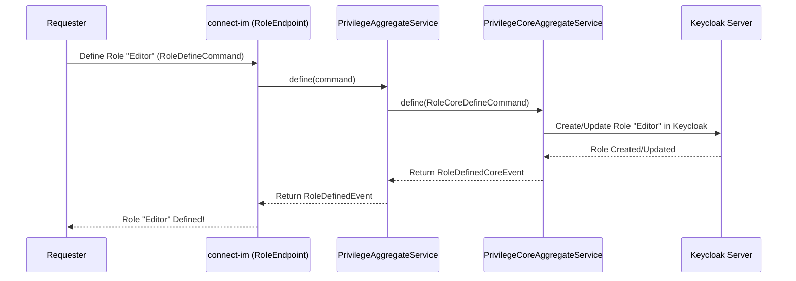

# Chapter 3: Privilege Management (Roles, Permissions, Features)

Welcome back! In [Chapter 2: F2 Functions (API Layer)](02_f2_functions__api_layer__.md), we learned about **F2 Functions**, which are like specialized service desks that let us interact with `connect-im`. We saw how we can send commands like "create a user" or "get organization details."

But a crucial question arises: How does `connect-im` know *who* is allowed to do *what*? For example, should any user be able to create new organizations? Or delete other users? Definitely not! We need a system to manage these authorizations. This is where **Privilege Management** comes in.

## The Problem: Who Can Do What?

Imagine you're building a collaborative platform for "Company X" using `connect-im`. Within Company X's Space (see [Chapter 1: Spaces (Keycloak Realms)](01_spaces__keycloak_realms__.md)), you'll have different kinds of users:
*   **Administrators:** They should be able to add new users, change company settings, and generally manage the Space.
*   **Project Managers:** They should be able to create projects and assign tasks, but not add new users to the company.
*   **Team Members:** They should be able to work on tasks and view project details, but not create new projects or manage users.

How do we ensure that Team Members can't accidentally (or intentionally) delete users, and Project Managers can't change company-wide settings? We need a clear and robust way to define these rules.

## Introducing Roles, Permissions, and Features: The Building Security Analogy

`connect-im` uses a system of **Roles**, **Permissions**, and **Features** to control who can do what. Let's use an analogy: imagine a secure office building.

*   **Features:** These are like different **security zones** or high-level functionalities in the building. For example:
    *   "Lobby Access" (e.g., `feat_public_access`)
    *   "General Office Access" (e.g., `feat_office_area`)
    *   "Server Room Access" (e.g., `feat_server_management`)
    A feature can be enabled or disabled for a Space or even parts of it. If "Server Room Access" is disabled, no one can enter, regardless of their keycard.

*   **Permissions:** These are **specific, granular actions** allowed within those zones. For example:
    *   "Enter Lobby" (e.g., `im_lobby_enter`)
    *   "Use Office Desk" (e.g., `im_desk_use`)
    *   "Reboot Server" (e.g., `im_server_reboot`)
    A permission, like "Reboot Server", might only be active if the corresponding "Server Room Access" feature is enabled.

*   **Roles:** These are like **keycards** (or job titles) that bundle a set of permissions. You assign a keycard (Role) to a person or a department.
    *   **"Visitor" Keycard (Role):** Grants "Enter Lobby" permission.
    *   **"Employee" Keycard (Role):** Grants "Enter Lobby" and "Use Office Desk" permissions.
    *   **"IT Admin" Keycard (Role):** Grants "Enter Lobby", "Use Office Desk", and "Reboot Server" permissions.

When a user tries to perform an action, `connect-im` checks:
1.  Does the user have a Role that grants the necessary Permission?
2.  Are all the Features required by that Permission active?

Let's dive into each of these concepts.

### 1. Permissions: The Specific Actions

A **Permission** represents a single, precise action that can be performed in the system. Think of it as the smallest unit of "can do."

In `connect-im`, permissions have unique identifiers. Here are a few examples (you can see more in `ImPermission.kt` or the `README.md`):

*   `im_user_write`: The ability to create or modify user data.
*   `im_organization_read`: The ability to view organization data.
*   `im_role_read`: The ability to view role definitions.

When you define a permission in `connect-im`, you typically provide:
*   An `identifier` (like `im_user_write`).
*   A `description` (e.g., "Ability to modify any user data").
*   Optionally, a list of `features` that gate this permission.

Here's a conceptual look at what a Permission's data structure (DTO - Data Transfer Object) might look like, based on `PermissionDTO.kt`:

```kotlin
// Conceptual representation of a Permission
data class Permission(
    val id: String, // A unique system ID
    val identifier: String, // e.g., "im_user_write"
    val description: String, // "Ability to modify user data"
    // Features that need to be active for this permission to work
    val features: List<List<String>>? // e.g., [["feat_user_management"]]
)
```
The `features` field indicates which features must be active. For example, `im_user_write` might only be usable if a feature like `feat_user_management` is enabled. The `List<List<String>>` means that the permission is active if *any* of the inner lists of features are *all* active. For instance, `[["featA", "featB"], ["featC"]]` means (featA AND featB must be active) OR (featC must be active).

### 2. Features: The High-Level Functionalities (Security Zones)

A **Feature** represents a larger piece of functionality or a context within your application. As in our analogy, they are like security zones. Disabling a feature can disable a whole set of related permissions, even if users have roles that include those permissions.

For example, you might have a `feat_im_organization_management` feature. If this feature is disabled in a particular Space, then permissions like `im_organization_write` (modify organization data) might not work, even if a user has a role granting it.

Here's a conceptual `FeatureDTO` based on `FeatureDTO.kt`:

```kotlin
// Conceptual representation of a Feature
data class Feature(
    val id: String, // A unique system ID
    val identifier: String, // e.g., "feat_im_organization_management"
    val description: String // "Controls access to organization management tools"
)
```

### 3. Roles: The Keycards (Bundles of Permissions)

A **Role** is a named collection of permissions. Instead of assigning individual permissions to users one by one (which would be very tedious and error-prone), you group related permissions into a Role, and then assign that Role to users or organizations.

For example, an "OrganizationAdmin" role might include:
*   `im_organization_write` (to modify their organization's data)
*   `im_user_read` (to see users within their organization)
*   `im_user_write` (to add/modify users in their organization)

Here's a conceptual `RoleDTO` based on `RoleDTO.kt`:

```kotlin
// Conceptual representation of a Role
data class Role(
    val id: String, // A unique system ID
    val identifier: String, // e.g., "OrganizationAdmin"
    val description: String, // "Administrator for an organization"
    val permissions: List<String>, // List of permission identifiers
                                   // e.g., ["im_organization_write", "im_user_read"]
    val targets: List<String>, // Who can this role be assigned to?
                               // e.g., ["USER", "ORGANIZATION"]
    // ... other properties like localized names (locale),
    // or roles that can be bound to this one (bindings)
)
```
*   `permissions`: A list of permission identifiers (like `im_user_write`) that this role grants.
*   `targets`: Specifies what kind of entities this role can be assigned to (e.g., directly to a `USER`, or to an `ORGANIZATION`).

## Managing Privileges in `connect-im`

Now that we understand the concepts, how do we actually define these Permissions, Features, and Roles in `connect-im`? We use F2 Functions, similar to what we saw in [Chapter 2: F2 Functions (API Layer)](02_f2_functions__api_layer__.md).

`connect-im` provides F2 Endpoints like `PermissionEndpoint.kt`, `RoleEndpoint.kt`, and `FeatureEndpoint.kt` for these tasks.

### Defining a Permission

To define a new permission, you'd send a command (like `PermissionDefineCommand`) to the appropriate F2 function.

Conceptually, the command would look like this:
```kotlin
// Conceptual command to define a permission
val definePermCmd = PermissionDefineCommand(
    identifier = "im_document_edit",
    description = "Ability to edit documents",
    features = listOf(listOf("feat_document_management")) // Requires this feature
)

// This would be sent to an F2 function, e.g., permissionDefine(definePermCmd)
```
If successful, `connect-im` would respond with an event like `PermissionDefinedEvent`, confirming the permission is created and providing its unique ID.

### Defining a Role

Similarly, to define a new role, you'd use a `RoleDefineCommand`:
```kotlin
// Conceptual command to define a role
val defineRoleCmd = RoleDefineCommand(
    identifier = "DocumentEditorRole",
    description = "Can edit documents within the organization",
    permissions = listOf("im_document_view", "im_document_edit"),
    targets = listOf("USER"), // This role can be assigned to users
    locale = mapOf("en" to "Document Editor", "fr" to "Éditeur de documents")
)

// This would be sent to an F2 function, e.g., roleDefine(defineRoleCmd)
```
This command tells `connect-im` to create a role named "DocumentEditorRole" that grants the `im_document_view` and `im_document_edit` permissions and can be assigned to users. A successful operation would result in a `RoleDefinedEvent`.

**Important Note:** This chapter focuses on *defining* what Permissions, Features, and Roles *exist*. The actual assignment of these roles to users or organizations happens when you manage those users or organizations (e.g., via `UserCreateCommand` or `UserUpdateCommand`, which might have a `roles` field).

## Under the Hood: How Definitions Work

When you send a command like `RoleDefineCommand` to an F2 function (e.g., via `RoleEndpoint`):

1.  **Request Received:** The F2 function in `connect-im` receives your command.
2.  **Delegation to Service:** The F2 function typically delegates the work to a specialized service, like `PrivilegeAggregateService.kt`.
3.  **Core Logic:** The `PrivilegeAggregateService` takes the F2 command (e.g., `RoleDefineCommand`) and transforms it into a core command (e.g., `RoleCoreDefineCommand`). This core command is then processed by `PrivilegeCoreAggregateService`.
4.  **Interaction with Keycloak:** This core service interacts with Keycloak. Keycloak is where these roles and permissions are actually stored.
    *   For **Roles**: `connect-im` will create a corresponding role in the Keycloak realm (Space).
    *   For **Permissions**: Keycloak doesn't have a direct "permission" concept in the same way `connect-im` defines it. `connect-im` manages permissions as its own entities and links them to roles. When roles are created in Keycloak, `connect-im` might associate them with specific client roles or composite roles that represent these granular permissions, or use other mechanisms to enforce them. Features also influence this logic.
5.  **Confirmation:** Keycloak confirms the creation/update, and an event (e.g., `RoleDefinedEvent`) is sent back to you.

Here’s a simplified view of defining a role:



Let's look at a tiny piece of `PrivilegeAggregateService.kt` that handles defining a role:

```kotlin
// Simplified snippet from PrivilegeAggregateService.kt

suspend fun define(command: RoleDefineCommand): RoleDefinedEvent {
    // Maps the F2 command to a core command
    val coreCommand = RoleCoreDefineCommand(
        identifier = command.identifier,
        description = command.description,
        targets = command.targets.map(RoleTarget::valueOf), // Converts string targets
        permissions = command.permissions,
        // ... other mappings ...
    )
    // Calls the core service to do the actual work
    val event = privilegeCoreAggregateService.define(coreCommand)
    return RoleDefinedEvent(identifier = event.identifier)
}
```
This `PrivilegeAggregateService` acts as a bridge, translating the simpler F2 commands into more detailed core commands understood by the underlying `PrivilegeCoreAggregateService`, which then deals with Keycloak.

Similarly, if you want to list all available roles or get details about a specific permission, you'd use query F2 functions that call `PrivilegeFinderService.kt`. This service, in turn, fetches the information from Keycloak via `PrivilegeCoreFinderService`.

```kotlin
// Simplified snippet from PrivilegeFinderService.kt

suspend fun getRoleOrNull(identifier: RoleIdentifier): Role? {
    // Gets the core privilege model from the core finder service
    val privilegeModel = privilegeCoreFinderService.getPrivilegeOrNull(identifier)

    // Checks if it's a RoleModel and converts it to a Role DTO
    return (privilegeModel as? RoleModel)?.toDTO()
}

// The .toDTO() extension function would convert RoleModel to the Role DTO,
// potentially fetching linked permissions or other details.
```
This shows how `PrivilegeFinderService` fetches the raw data and then converts it into the `Role` DTO format that your application can easily understand.

## Conclusion

You've now learned about the crucial concepts of **Permissions**, **Features**, and **Roles** in `connect-im`.
*   **Permissions** are fine-grained actions (`im_user_write`).
*   **Features** are high-level functionalities that can enable or disable groups of permissions (`feat_user_management`).
*   **Roles** bundle permissions and are assigned to users or organizations (`OrganizationAdmin`).

This system provides a powerful and flexible way to manage "who can do what" within your `connect-im` Spaces. We saw how you can define these using F2 Functions and how `connect-im` manages them, ultimately relying on Keycloak for storage and enforcement.

Now that we understand Spaces (Chapter 1), how to talk to `connect-im` via F2 Functions (Chapter 2), and how access is structured (Chapter 3), what's the "brain" behind all this? How does `connect-im` actually execute the commands and interact with Keycloak in detail?

Let's move on to [Chapter 4: Keycloak Client & Core Services (Backend Logic)](04_keycloak_client___core_services__backend_logic__.md) to explore the backend services that power these operations.

---

Generated by [AI Codebase Knowledge Builder](https://github.com/The-Pocket/Tutorial-Codebase-Knowledge)