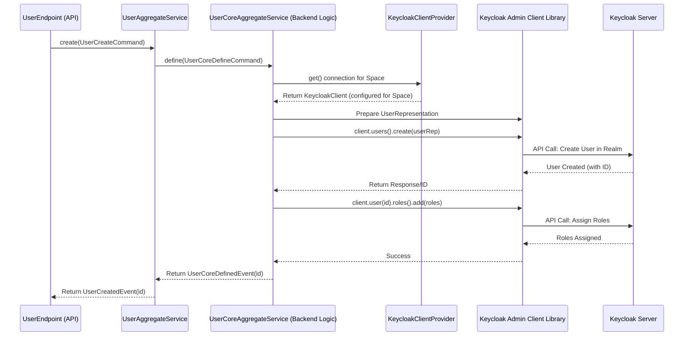

# Chapter 4: Keycloak Client & Core Services (Backend Logic)

Welcome back! In [Chapter 3: Privilege Management (Roles, Permissions, Features)](03_privilege_management__roles__permissions__features__.md), we learned how `connect-im` controls who can do what using Roles, Permissions, and Features – like the security system in our office building analogy. We also saw in [Chapter 2: F2 Functions (API Layer)](02_f2_functions__api_layer__.md) that F2 Functions are the "service desks" or API endpoints we use to make requests.

Now, we'll peek behind those service desks and into the "engine room" of `connect-im`. When an F2 Function receives a request (like "create user" or "define role"), what happens next? How does `connect-im` actually talk to the underlying Keycloak system to make things happen? That's where the **Keycloak Client** and **Core Services** come in.

## The Problem: How Do We Control the Engine?

Imagine our `connect-im` system is a large ship. We have different control stations on the bridge (the F2 Functions) for steering, navigation, communication, etc. But how do these controls actually connect to the main engines, the rudder, and other vital machinery deep in the ship's hull?

Similarly, our F2 Functions need a reliable way to connect to and command the underlying Keycloak identity engine. We also need specialized "engineers" who know exactly *how* to operate specific parts of that engine (like user management, organization management, or role management) without interfering with each other.

## Introducing the Keycloak Client Provider and Core Services: The Engine Room Controls

`connect-im` solves this with two key components:

1.  **`KeycloakClientProvider` (The Main Control Panel):**
    *   Think of this as the central control panel in the engine room that establishes a secure connection to the main Keycloak engine.
    *   Crucially, it knows which specific **Space** (Keycloak Realm) we are currently working in. When you make a request concerning "Company A's Space", this provider ensures the connection targets *only* Company A's isolated section within Keycloak.
    *   It handles the technical details of authentication and connection management with Keycloak.

2.  **Core Services (The Specialist Engineers):**
    *   These are like specialized engineers, each an expert in managing one specific part of the Keycloak engine via the control panel.
    *   Examples include:
        *   `UserCoreAggregateService`: Knows how to create, update, delete, and find users.
        *   `OrganizationCoreAggregateService`: Knows how to manage organizations (groups in Keycloak).
        *   `PrivilegeCoreAggregateService`: Knows how to define roles and manage permissions.
        *   `ClientCoreAggregateService`: Knows how to manage applications (clients in Keycloak).
    *   They take commands (like "create this user with these details") and translate them into precise instructions for Keycloak, using the connection provided by `KeycloakClientProvider`.

These services form the **backend logic** or the "core" of `connect-im`. They contain the detailed steps and business rules for interacting with Keycloak.

## How It Works: Creating a User (Example Revisited)

Let's trace the journey of a "Create User" request, focusing on the backend this time:

1.  **Request Arrives at F2:** Your application sends a `UserCreateCommand` to the `userCreate()` F2 function (as seen in [Chapter 2: F2 Functions (API Layer)](02_f2_functions__api_layer__.md)).
2.  **F2 Delegates to Aggregate Service:** The `UserEndpoint` (F2 Function) calls the `UserAggregateService`. This service might do some initial validation or translation.
3.  **Aggregate Delegates to Core Service:** The `UserAggregateService` often translates the F2 command into a more detailed `UserCoreDefineCommand` and passes it to the `UserCoreAggregateService`. This is our "User Specialist Engineer."
4.  **Core Service Gets Connection:** The `UserCoreAggregateService` needs to talk to Keycloak. It asks the `KeycloakClientProvider` for a connection configured for the correct **Space** (Realm).
    ```kotlin
    // Simplified snippet from UserCoreAggregateService.kt
    // Get the connection to the correct Keycloak Realm (Space)
    val client = keycloakClientProvider.get()
    ```
    This line is like the engineer selecting the right controls on the panel for the target system. `keycloakClientProvider.get()` uses information about the current request (which Space it's for) to provide a correctly configured `KeycloakClient`.

5.  **Core Service Prepares Keycloak Data:** The service prepares the user's details in the format Keycloak understands (a `UserRepresentation`).
    ```kotlin
    // Simplified snippet from UserCoreAggregateService.kt
    // Prepare user details for Keycloak
    val userRepresentation = UserRepresentation().apply {
        email = command.email
        firstName = command.givenName
        lastName = command.familyName
        isEnabled = true
        // ... set attributes, username etc. ...
    }
    ```

6.  **Core Service Sends Command to Keycloak:** Using the `client` obtained in step 4, the service tells Keycloak to create the user.
    ```kotlin
    // Simplified snippet from UserCoreAggregateService.kt
    // Tell Keycloak (via the client) to create the user
    val response = client.users().create(userRepresentation)
    // ... handle potential errors from response ...
    val userId = response.handleResponseError("User") // Get the new user's ID
    ```
    This interacts directly with the Keycloak API via the Keycloak Admin Client library.

7.  **Core Service Performs Additional Steps:** It might assign roles or add the user to groups, again using the `client`.
    ```kotlin
    // Simplified snippet from UserCoreAggregateService.kt
    // Assign roles if provided
    command.roles?.let { roleNames ->
        val roles = roleNames.map { client.role(it).toRepresentation() }
        client.user(userId).roles().realmLevel().add(roles)
    }
    ```

8.  **Result Returned:** The `UserCoreAggregateService` creates a success event (`UserCoreDefinedEvent` containing the new `userId`) and returns it up the chain (to `UserAggregateService`, then `UserEndpoint`, then back to your application).

## Under the Hood: The Flow of Control

Let's visualize this flow for creating a user:



This diagram shows the clear separation:
*   **F2/Aggregate Services:** Handle the API request and initial processing.
*   **Core Service (`UserCoreAggregateService`):** Contains the specific logic for user creation.
*   **`KeycloakClientProvider`:** Provides the necessary connection to the correct Keycloak Space.
*   **Keycloak Admin Client:** The library used to actually talk to Keycloak.
*   **Keycloak Server:** The underlying identity engine.

### Looking at the Code

Let's glance at simplified parts of the key players:

**1. `KeycloakClientProvider.kt`**

This service is responsible for providing a `KeycloakClient` instance configured for the correct realm (Space).

```kotlin
// Simplified from im-infra/im-keycloak/src/main/kotlin/io/komune/im/infra/keycloak/client/KeycloakClientProvider.kt
@Service
class KeycloakClientProvider(...) {
    // Cache connections to avoid recreating them constantly
    private var connection: KeycloakClientBuilder.KeycloakClientConnection? = null
    private val cache = mutableMapOf<RealmId, KeycloakClient>()

    // Gets a client for the Space specified in the current request context
    suspend fun get(): KeycloakClient {
        val auth = /* Get auth details for current request, including target Space */;
        val keycloakConnection = connection ?: KeycloakClientBuilder.openConnection(auth)
        // Return a cached or new client specifically for this Space
        return cache.getOrPut(auth.space) {
            keycloakConnection.forRealm(auth.space)
        }
    }
}
```
*   It figures out which `Space` (RealmId) the current operation targets.
*   It uses `KeycloakClientBuilder` to establish a connection if one doesn't exist.
*   It returns a `KeycloakClient` object ready to interact with that specific Space.

**2. `KeycloakClient.kt`**

This class wraps the actual Keycloak Admin library calls, ensuring they target the correct realm.

```kotlin
// Simplified from im-infra/im-keycloak/src/main/kotlin/io/komune/im/infra/keycloak/client/KeycloakClient.kt
class KeycloakClient(
    val keycloak: Keycloak, // The raw Keycloak connection
    val realmId: RealmId   // The SPECIFIC realm (Space) this client targets
) {
    // Provides access to user operations *within this realm*
    fun users(): UsersResource {
        return keycloak.realm(realmId).users()
    }

    // Provides access to role operations *within this realm*
    fun roles(): RolesResource {
        return keycloak.realm(realmId).roles()
    }

    // Provides access to group operations *within this realm*
    fun groups(): GroupsResource {
        return keycloak.realm(realmId).groups()
    }
    // ... methods for clients(), realm(), etc. ...
}
```
*   It holds the connection (`keycloak`) and the target `realmId`.
*   Methods like `users()`, `roles()`, `groups()` return Keycloak resource objects that are already scoped to the correct realm, preventing accidental changes in the wrong Space.

**3. Core Services (e.g., `OrganizationCoreAggregateService.kt`)**

These services use the `KeycloakClient` provided by the `KeycloakClientProvider` to execute business logic.

```kotlin
// Simplified from im-core/organization-core/im-organization-core-api/src/main/kotlin/io/komune/im/core/organization/api/OrganizationCoreAggregateService.kt
@Service
class OrganizationCoreAggregateService: CoreService(...) {

    suspend fun define(command: OrganizationCoreDefineCommand) {
        // 1. Get the client for the current space
        val client = keycloakClientProvider.get()

        // 2. Prepare Keycloak group data
        val group = GroupRepresentation().apply {
            name = command.identifier
            attributes = command.attributes // Simplified
            // ... set other organization details ...
        }

        // 3. Tell Keycloak (via client) to create/update the group
        if (/* organization exists */) {
             client.group(command.id!!).update(group)
        } else {
             client.groups().add(group)
        }

        // 4. Assign roles to the group (organization)
        val newRoles = command.roles.map { client.role(it).toRepresentation() }
        client.group(groupId).roles().realmLevel().add(newRoles)

        // 5. Return success event
        // return OrganizationCoreDefinedEvent(groupId)
    }
    // ... other methods like delete(), setAttributes() ...
}
```
*   Notice the pattern: Get the `client`, prepare data (`GroupRepresentation`), use the `client` to interact with Keycloak (`client.groups().add()`, `client.role()`, `client.group().roles()...`), return an event.
*   Each Core Service focuses on its specific domain (organizations, users, roles, etc.).

## Conclusion

You've now explored the "engine room" of `connect-im`! We learned about:
*   **`KeycloakClientProvider`**: The central control panel establishing a secure, Space-specific connection to Keycloak.
*   **Core Services** (like `UserCoreAggregateService`, `OrganizationCoreAggregateService`): The specialized backend logic components that use the Keycloak connection to manage users, organizations, roles, etc.

These components are the heart of `connect-im`, translating the high-level requests from F2 Functions into concrete actions within the Keycloak identity engine. They ensure operations happen correctly and within the boundaries of the intended [Space (Keycloak Realm)](01_spaces__keycloak_realms__.md).

So far, we know how to create Spaces, how to send commands via F2 Functions, how permissions are structured, and how the backend logic executes these commands. But how does `connect-im` *enforce* the rules we defined in Chapter 3? How does it check if a user *actually* has the required role or permission before letting a Core Service execute an action?

Let's move on to [Chapter 5: Policy Enforcement](05_policy_enforcement_.md) to see how `connect-im` ensures only authorized actions are performed.

---

Generated by [AI Codebase Knowledge Builder](https://github.com/The-Pocket/Tutorial-Codebase-Knowledge)