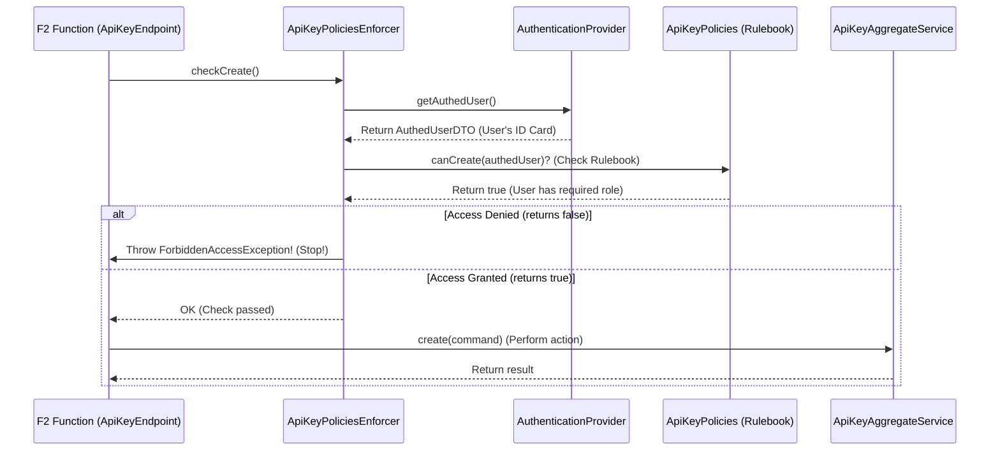

# Chapter 5: Policy Enforcement

Welcome back! In [Chapter 4: Keycloak Client & Core Services (Backend Logic)](04_keycloak_client___core_services__backend_logic__.md), we explored the "engine room" of `connect-im` – the core services that interact with Keycloak to manage users, organizations, and more. We saw how they execute the commands sent via [F2 Functions (API Layer)](02_f2_functions__api_layer__.md).

But how does `connect-im` ensure that only the *right* people or services can trigger these powerful actions? How do we prevent a regular user from, say, deleting an entire organization or creating system-wide administrator roles? This is where **Policy Enforcement** comes in.

## The Problem: Who Gets Past the Guard?

Imagine our `connect-im` system is like a secure building with many rooms and functions. We have defined different job roles ([Roles, Permissions, Features](03_privilege_management__roles__permissions__features__.md)) like "Employee", "Manager", or "Security Admin". We also have the backend services (Core Services) that can perform actions like unlocking doors, accessing files, or changing building settings.

The problem is, we need a **checkpoint system** – security guards at every important door or function – to check if someone trying to perform an action actually has the permission to do so based on their assigned role (their keycard). Without these checks, anyone could potentially do anything, leading to chaos and security breaches.

## Introducing Policy Enforcement: Your Security Checkpoint System

**Policy Enforcement** in `connect-im` acts as this crucial security checkpoint system. Before any significant action (like creating a user, modifying an organization, or generating an API key) is allowed to proceed, a **Policy Enforcer** steps in.

Think of it like this:
1.  **You (or a service) approach a door (an F2 Function):** You want to perform an action, like "Create an API Key".
2.  **The Security Guard (Policy Enforcer) stops you:** "Hold on! Let me see your ID and check if you're allowed to do that."
3.  **You present your ID (Authenticated User - `AuthedUserDTO`):** The system automatically knows who is making the request. This "ID" contains information like your user ID, the organization you belong to, and the roles assigned to you (e.g., "ApiKeyManager", "OrganizationAdmin").
4.  **The Guard checks the Rulebook (Policies):** The Policy Enforcer consults a specific set of rules (like `ApiKeyPolicies`, `UserPolicies`, `OrganizationPolicies`) for the action you requested. These rules define which roles or conditions are needed. For example, the `ApiKeyPolicies` might say: "To create an API key, the user must have the `IM_APIKEY_WRITE` role."
5.  **Decision:**
    *   **Access Granted:** If your ID (roles) matches the requirements in the rulebook, the guard lets you pass, and the F2 function proceeds to call the [Core Services (Backend Logic)](04_keycloak_client___core_services__backend_logic__.md) to perform the action.
    *   **Access Denied:** If you don't have the required permissions, the guard stops you, and the system returns an error (a `ForbiddenAccessException`), preventing the action from happening.

The key components are:
*   **`PolicyEnforcer`:** Services responsible for performing the checks (the guards). There are specific enforcers for different areas (e.g., `ApiKeyPoliciesEnforcer`, `UserPoliciesEnforcer`).
*   **`AuthedUserDTO`:** Represents the identity and permissions of the user or service making the request (the ID card).
*   **`Policies` (e.g., `ApiKeyPolicies`)**: Static objects containing the actual rules (the rulebook) defining *who* can do *what*.

## How to Use Policy Enforcement (How F2 Functions Use It)

You generally don't interact with Policy Enforcers *directly* when just using the `connect-im` API. Instead, the **F2 Functions** you call (like `apiKeyCreate`, `userUpdate`, `organizationGet`) use these enforcers internally before executing their main logic.

Let's look at how an F2 function like `apiKeyCreate` might use the `ApiKeyPoliciesEnforcer` *before* it actually creates the key:

```kotlin
// Simplified snippet from an F2 Endpoint (like ApiKeyEndpoint.kt)

// Inject the specific enforcer for API Keys
private val apiKeyPoliciesEnforcer: ApiKeyPoliciesEnforcer
// Inject the service that does the actual work
private val apiKeyAggregateService: ApiKeyAggregateService

// The F2 function definition
override fun apiKeyCreate(): ApiKeyCreateFunction = f2Function { command ->
    logger.info("apiKeyCreate: $command")

    // --- CHECKPOINT ---
    // Ask the enforcer to check if the current user can create an API key
    apiKeyPoliciesEnforcer.checkCreate()
    // If the check fails, an exception is thrown and the code below is skipped.
    // --- /CHECKPOINT ---

    // If the check passes, proceed to call the core service
    apiKeyAggregateService.create(command)
}
```

1.  The `apiKeyCreate` function receives the command.
2.  **Crucially**, it calls `apiKeyPoliciesEnforcer.checkCreate()`.
3.  The `checkCreate` method performs the security check (we'll see how below).
4.  If the user is authorized, the `checkCreate` method completes without error, and the code continues to `apiKeyAggregateService.create(command)`.
5.  If the user is *not* authorized, `checkCreate` throws an exception, stopping the execution immediately and preventing the API key from being created.

This pattern ensures security rules are checked consistently before actions are performed.

## Under the Hood: How a Policy Check Works

Let's dive a bit deeper into what happens during that `apiKeyPoliciesEnforcer.checkCreate()` call:

1.  **Get Current User:** The `checkCreate` method (inside `ApiKeyPoliciesEnforcer`) first needs to know *who* is making the request. It uses a helper (`AuthenticationProvider.getAuthedUser()`) to get the `AuthedUserDTO` object representing the currently logged-in user or authenticated service. This object contains their roles and organization ID.
2.  **Consult the Rulebook:** The enforcer then calls the relevant rule defined in the static `Policies` object. In this case, it would call `ApiKeyPolicies.canCreate(authedUser)`.
3.  **Check the Rule:** The `ApiKeyPolicies.canCreate` method contains the specific logic. It checks if the provided `authedUser` has the required role (e.g., `IM_APIKEY_WRITE`). It might use helper functions like `authedUser.hasRole("IM_APIKEY_WRITE")`.
4.  **Return Decision:** The `canCreate` method returns `true` if the user has the role, `false` otherwise.
5.  **Enforce Decision:**
    *   If `canCreate` returned `true`, the `checkCreate` method in the enforcer simply finishes, allowing the F2 function to continue.
    *   If `canCreate` returned `false`, the `checkCreate` method throws a `ForbiddenAccessException` with a message like "User [xyz] is not authorized to create an apikey". This exception stops the F2 function and results in an error response to the original caller.

Here's a simplified sequence diagram illustrating this:



### Looking at the Code Snippets

Let's look at simplified versions of the relevant code pieces:

**1. `PolicyEnforcer.kt` (The Base Guard Class)**

This base class provides common helper methods like `checkAuthed`.

```kotlin
// Simplified from im-commons/im-commons-auth/.../PolicyEnforcer.kt
open class PolicyEnforcer {
    // Checks if the user is authenticated AND if a specific condition is met
    protected suspend fun checkAuthed(
        action: String, // Description for error messages
        hasAccess: suspend (AuthedUserDTO) -> Boolean // The rule to check
    ) = check(action) { authedUser ->
            // User must exist AND the hasAccess check must pass
            authedUser != null && hasAccess(authedUser)
        }

    // The core check logic
    protected suspend fun check(
        action: String,
        hasAccess: suspend (AuthedUserDTO?) -> Boolean
    ) = enforce { authedUser -> // 'enforce' gets the current user
            if (!hasAccess(authedUser)) { // If the rule check fails...
                // ...throw an error!
                throw ForbiddenAccessException("... not authorized to $action")
            }
        }

    // Helper to get the currently authenticated user
    protected suspend fun <R> enforce(block: suspend (AuthedUserDTO?) -> R): R {
        return block(AuthenticationProvider.getAuthedUser())
    }
}
```
*   `checkAuthed`: Ensures a user is logged in (`authedUser != null`) and passes a specific `hasAccess` check.
*   `check`: If the `hasAccess` check fails, it throws the `ForbiddenAccessException`.
*   `enforce`: A wrapper to get the current user (`AuthedUserDTO`) via `AuthenticationProvider`.

**2. `ApiKeyPoliciesEnforcer.kt` (The Specific Guard for API Keys)**

This class uses the base `PolicyEnforcer` and defines checks specific to API keys, calling the static `ApiKeyPolicies`.

```kotlin
// Simplified from im-f2/apikey/im-apikey-api/.../ApiKeyPoliciesEnforcer.kt
@Service // Marks this as a service component
class ApiKeyPoliciesEnforcer: PolicyEnforcer() { // Inherits base guard features

    // Defines the check for creating an API key
    suspend fun checkCreate() = checkAuthed("create an apikey") { authedUser ->
        // Delegate the actual rule check to the static Policy object
        ApiKeyPolicies.canCreate(authedUser)
    }

    // Other checks like checkGet(), checkDelete()...
    suspend fun checkGet(apikeyId: ApiKeyId) = checkAuthed("get apikey") { authedUser ->
        ApiKeyPolicies.canGet(authedUser, apikeyId)
    }
}
```
*   It extends `PolicyEnforcer`.
*   `checkCreate` calls the base `checkAuthed`, passing a lambda function `{ authedUser -> ApiKeyPolicies.canCreate(authedUser) }` as the specific rule to evaluate.

**3. `ApiKeyPolicies.kt` (The Rulebook for API Keys)**

This object contains the actual logic for API key permissions.

```kotlin
// Simplified from im-f2/apikey/im-apikey-domain/.../ApiKeyPolicies.kt
object ApiKeyPolicies {
    // Rule: Can the user create an API key?
    fun canCreate(authedUser: AuthedUserDTO): Boolean {
        // Check if the user has the 'IM_APIKEY_WRITE' role
        return authedUser.hasRole(ImPermission.IM_APIKEY_WRITE)
    }

    // Rule: Can the user get a specific API key?
    fun canGet(authedUser: AuthedUserDTO, apikeyId: String): Boolean {
        // Check if user has global read permission OR if the key belongs to their org
        return authedUser.hasRole(ImPermission.IM_APIKEY_READ) // Or maybe check memberOf?
            // || authedUser.memberOf == apikeyOrganizationId // Logic depends on requirements
    }
    // ... other rules like canDelete() ...
}
```
*   `canCreate`: Simply checks for the presence of the `IM_APIKEY_WRITE` role using a helper function.
*   `canGet`: Shows a slightly more complex rule, perhaps checking for a general read role OR ownership.

**4. `AuthedUser.kt` (The ID Card Details and Helpers)**

This file defines the `AuthedUserDTO` interface and provides helpful extension functions like `hasRole`.

```kotlin
// Simplified from im-commons/im-commons-domain/.../AuthedUser.kt

// Interface defining the authenticated user's data
interface AuthedUserDTO {
    val id: UserId
    val memberOf: OrganizationId? // Which org they belong to
    val roles: Array<String>?      // List of assigned roles
    // ... other fields like identifier, acr
}

// Helper function to check if the user has a specific role
fun AuthedUserDTO.hasRole(roleIdentifier: String) =
    roleIdentifier in (roles ?: emptyArray())

// Helper function to check based on ImPermission enum
fun AuthedUserDTO.hasRole(role: ImPermission) =
    hasRole(role.identifier)
```
*   `AuthedUserDTO`: Contains the essential info: `id`, `memberOf` (organization), and `roles`.
*   `hasRole`: A simple check if a given role identifier string exists in the user's `roles` array.

This combination of specific enforcers, static policy rules, and the authenticated user's details creates a robust system for controlling access within `connect-im`.

## Conclusion

You've now learned about **Policy Enforcement**, the security checkpoint system in `connect-im`. We saw how:
*   **Policy Enforcers** act like security guards at the entrance of F2 Functions.
*   They check the **`AuthedUserDTO`** (the user's ID card with roles) against rules defined in **`Policies`** (the rulebook).
*   This check happens *before* any core logic is executed, preventing unauthorized actions.
*   If a check fails, a `ForbiddenAccessException` is thrown, stopping the process.

This mechanism ensures that the permissions and roles defined using the concepts from [Chapter 3: Privilege Management (Roles, Permissions, Features)](03_privilege_management__roles__permissions__features__.md) are strictly enforced throughout the system.

We've covered the main building blocks of `connect-im`: Spaces, F2 Functions, Privilege Management, Core Services, and now Policy Enforcement. How do we tie all this together, especially when setting up a new `connect-im` instance or configuring multiple Spaces?

Let's move on to the final chapter, [Chapter 6: Configuration & Initialization Scripts](06_configuration___initialization_scripts__.md), to see how `connect-im` uses scripts to automate setup and configuration.

---

Generated by [AI Codebase Knowledge Builder](https://github.com/The-Pocket/Tutorial-Codebase-Knowledge)