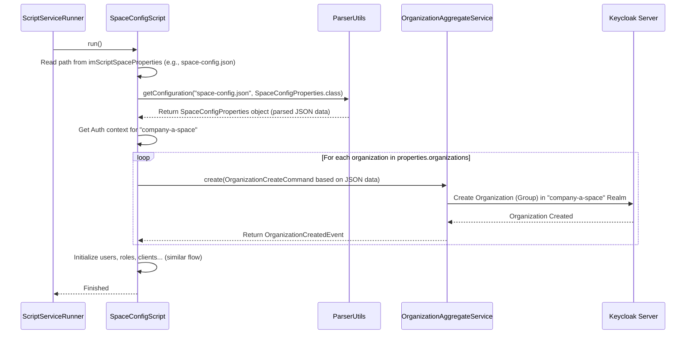

# Chapter 6: Configuration & Initialization Scripts

Welcome to the final chapter of our introductory `connect-im` tutorial! In [Chapter 5: Policy Enforcement](05_policy_enforcement_.md), we saw how `connect-im` acts like a security guard, using Policy Enforcers to ensure only authorized users can perform actions.

Now, imagine you need to set up `connect-im` not just once, but multiple times – perhaps for development, testing, and production environments. Or maybe you need to onboard dozens of new companies, each requiring its own [Space (Keycloak Realm)](01_spaces__keycloak_realms__.md) with specific users, roles, and applications. Doing this manually through API calls or a user interface for every single step would be incredibly time-consuming and prone to errors. How can we automate this setup process?

## The Problem: Setting Up is Tedious!

Think about setting up a brand new computer. You need to install the operating system, configure settings, install software, create user accounts, set permissions... doing this by hand every time is repetitive and slow. If you had 100 computers to set up, it would be a nightmare!

Similarly, initializing `connect-im` involves:
*   Setting up the main "master" Space (Realm).
*   Creating essential administrative clients and roles.
*   Creating new Spaces for different tenants or environments.
*   Configuring each Space with its unique users, [Roles, Permissions, Features](03_privilege_management__roles__permissions__features__.md), and applications ([Keycloak Client & Core Services (Backend Logic)](04_keycloak_client___core_services__backend_logic__.md)).

We need a way to define the desired setup once and then have the system automatically build itself according to that plan.

## Introducing Configuration Files and Initialization Scripts: Your Automated Setup Blueprint

`connect-im` provides **Configuration Files (JSON)** and **Initialization Scripts (Kotlin code)** to solve this exact problem.

*   **JSON Configuration Files:** These are like blueprints or detailed recipes. You write down, in a structured format (JSON), exactly how you want your `connect-im` system and its Spaces to look. This includes things like:
    *   Which Spaces to create.
    *   What themes or settings each Space should have.
    *   Which users, organizations, roles, and applications should exist within each Space.
    *   Initial passwords or API keys.

*   **Initialization Scripts:** These are like automated construction workers or chefs that read your blueprints (JSON files). They execute the necessary steps, calling the appropriate [F2 Functions (API Layer)](02_f2_functions__api_layer__.md) and [Keycloak Client & Core Services (Backend Logic)](04_keycloak_client___core_services__backend_logic__.md) to build or configure `connect-im` exactly as specified in the JSON files.

Think of this as **"Infrastructure as Code"** for your identity management system. Instead of clicking buttons or making manual API calls, you define the desired state in configuration files, and the scripts make it happen.

This brings huge benefits:
*   **Consistency:** Every setup is identical, reducing "it works on my machine" problems.
*   **Repeatability:** Easily set up new environments (dev, test, prod) or tear down and rebuild existing ones.
*   **Automation:** Saves massive amounts of time compared to manual setup.
*   **Version Control:** You can store your configuration files in Git, track changes, and collaborate.

## How It Works: Setting Up `connect-im` from Scratch

Let's walk through the typical process of using these scripts to initialize `connect-im` and configure a new Space.

**Step 1: Prepare the Blueprints (JSON Configuration Files)**

First, you create JSON files that describe what you want to set up.

*   **`init.json` (Master Realm Setup):** Defines things needed in the main `master` realm, like the core `im-root-client` used for managing Spaces.

    ```json
    // Conceptual init.json snippet
    {
      "rootClient": {
        "clientId": "im-root-client",
        "clientSecret": "a-very-secret-value"
      }
      // ... other master realm configurations ...
    }
    ```
    *(This tells the script to ensure a client named `im-root-client` exists in the master realm with the given secret.)*

*   **`space-create.json` (New Space Definition):** Defines the basic details of the new Space(s) you want to create.

    ```json
    // Conceptual space-create.json snippet
    {
      "spaceIdentifier": "company-a-space",
      "displayName": "Company A Portal",
      "theme": "company-a-theme",
      "locales": ["en", "es"],
      "adminUsers": [{ "email": "admin@companya.com", "password": "..." }]
      // ... other Space settings ...
    }
    ```
    *(This blueprint tells the script to create a new Space called `company-a-space` with specific display settings and an initial admin user.)*

*   **`space-config.json` (Space Internal Configuration):** Defines the users, roles, applications, organizations, etc., *within* the newly created Space.

    ```json
    // Conceptual space-config.json snippet
    {
      "spaceIdentifier": "company-a-space", // Which space this config applies to
      "roles": [ { "name": "ProjectManager", "permissions": ["create_project"] } ],
      "permissions": [ { "name": "create_project", "description": "..." } ],
      "users": [ { "email": "bob@companya.com", "roles": ["ProjectManager"] } ],
      "organizations": [ { "name": "Company A HQ", "roles": ["DefaultOrgRole"] } ]
      // ... clients, features, api keys etc. ...
    }
    ```
    *(This recipe tells the script to define specific roles, permissions, users, and organizations inside the `company-a-space`.)*

**Step 2: Specify File Locations**

You tell `connect-im` where to find these blueprint files, usually in a configuration file like `application.yml`.

```yaml
# Simplified snippet from im-script/im-script-gateway/src/main/resources/application.yml
im:
  script:
    init:
      # Location of the master realm setup file
      json: file:./config/init.json
    space:
      # Location of the file defining which spaces to create
      jsonCreate: file:./config/space-create.json
      # Location of the file defining the contents of those spaces
      jsonConfig: file:./config/space-config.json
    # ... authentication details for running scripts ...
```
*(This configuration points the scripts to the JSON files we created.)*

**Step 3: Run the Automated Installer (`ScriptServiceRunner`)**

When `connect-im` starts up in a "scripting" mode, a special service called `ScriptServiceRunner.kt` takes over. It acts like the main contractor, running the different initialization scripts in the correct order.

```kotlin
// Simplified snippet from im-script/im-script-gateway/src/main/kotlin/io/komune/im/script/gateway/ScriptServiceRunner.kt
@Service
class ScriptServiceRunner(
    private val imInitScript: ImInitScript, // Worker for master realm setup
    private val spaceCreateScript: SpaceCreateScript, // Worker for creating spaces
    private val spaceConfigScript: SpaceConfigScript // Worker for configuring spaces
    // ... other dependencies like retry logic ...
): CommandLineRunner {

    override fun run(vararg args: String?) = runBlocking {
        // Run scripts sequentially, with retries if needed
        runScript("Init", imInitScript::run)
        runScript("Realm-Create", spaceCreateScript::run)
        runScript("Realm-Config", spaceConfigScript::run)
        // ... close application context when done ...
    }
    // ... runScript helper method with retry logic ...
}
```
*(This runner first executes `imInitScript`, then `spaceCreateScript`, and finally `spaceConfigScript`.)*

**What each script does:**

*   **`ImInitScript`:** Reads `init.json`. Connects to the Keycloak `master` realm. Uses services like `ClientInitService` and `ClientCoreAggregateService` to ensure the required initial clients (like `im-root-client`) are set up correctly in the master realm.
*   **`SpaceCreateScript`:** Reads `space-create.json`. Connects to the `master` realm. Uses `SpaceAggregateService` to create the new Space (Realm) as defined (e.g., "company-a-space"). It might also perform minimal setup *within* the new Space, like defining core IM permissions using `PrivilegeAggregateService` or creating the initial admin user using `UserAggregateService`.
*   **`SpaceConfigScript`:** Reads `space-config.json`. Connects *specifically* to the newly created Space ("company-a-space"). It then uses various Aggregate services (`OrganizationAggregateService`, `UserAggregateService`, `PrivilegeAggregateService`, `ClientInitService`, `ApiKeyAggregateService`, etc.) to create the organizations, users, roles, clients, API keys, and other resources defined in the JSON, effectively "filling" the Space according to the blueprint.

**Step 4: Done!**

After the scripts complete, your `connect-im` instance and the specified Spaces are fully configured according to your JSON blueprints, ready to be used!

## Under the Hood: How the Scripts Work

Let's visualize the flow when the `SpaceConfigScript` runs to configure "company-a-space":



1.  The `ScriptServiceRunner` triggers the `SpaceConfigScript`.
2.  The script gets the path to `space-config.json` from its configuration (`ImScriptSpaceProperties`).
3.  It uses `ParserUtils` to read the JSON file and convert it into a structured Kotlin object (`SpaceConfigProperties`). This object mirrors the structure of your JSON.
4.  The script establishes an authenticated connection targeting the *specific Space* mentioned in the configuration (e.g., "company-a-space").
5.  It iterates through the data in the `SpaceConfigProperties` object (e.g., the list of organizations).
6.  For each item, it calls the relevant Aggregate Service (like `OrganizationAggregateService.create(...)` for organizations, `UserAggregateService.create(...)` for users, etc.), passing commands built from the JSON data.
7.  These services, as we learned in [Chapter 4: Keycloak Client & Core Services (Backend Logic)](04_keycloak_client___core_services__backend_logic__.md), interact with Keycloak to create or update the resources within the correct Space.
8.  The script repeats this for roles, permissions, clients, API keys, etc., until the Space is fully configured according to the blueprint.

Here's a peek at how `SpaceConfigScript.kt` might handle initializing organizations based on the parsed JSON data:

```kotlin
// Simplified snippet from im-script/im-script-space-config/src/main/kotlin/io/komune/im/script/space/config/SpaceConfigScript.kt

// properties: This is the SpaceConfigProperties object parsed from JSON
// auth: Contains authentication details for the target Space

// Function called to configure a space based on parsed properties
suspend fun config(auth: AuthSubRealm, properties: SpaceConfigProperties) {
    // Ensure we are working within the correct Space context
    withContext(AuthContext(auth)) {
        // ... verify space, init features, permissions, roles ...

        // Initialize organizations defined in the JSON
        initOrganizations(properties.organizations)

        // ... init users, clients, api keys ...
    }
}

// Helper function to initialize organizations
private suspend fun initOrganizations(organizations: List<OrganizationData>?) {
    // Check if there are organizations defined in the JSON
    if (organizations.isNullOrEmpty()) {
        logger.info("No Organizations to initialize")
        return
    }
    logger.info("Initializing Organizations...")
    // Process each organization definition from the JSON
    organizations.forEach { organizationData ->
        // Prepare the command using data from the JSON object
        val command = OrganizationCreateCommand(
            name = organizationData.name,
            description = organizationData.description,
            roles = organizationData.roles,
            // ... other fields from organizationData ...
        )
        // Call the Organization service to create it
        try {
            organizationAggregateService.create(command)
            // Also initialize users/apikeys within this organization if defined
            // initUsers(organizationData.users, ..., createdOrgId)
            // initApiKeys(organizationData.apiKeys, ..., createdOrgId)
        } catch (e: ConflictException) {
            logger.warn("Organization [${organizationData.name}] likely already exists.")
        }
        // ... handle errors or updates ...
    }
    logger.info("Initialized Organizations")
}
```
*   The `config` function orchestrates the setup within the correct Space's `AuthContext`.
*   `initOrganizations` iterates through the `organizations` list (which came from the parsed JSON).
*   For each `organizationData` item, it creates an `OrganizationCreateCommand` and calls `organizationAggregateService.create()`.
*   It uses a `try-catch` block to handle cases where an organization might already exist (making the script *idempotent* – meaning you can run it multiple times without causing errors). Similar logic applies to initializing users, roles, clients, etc.

The corresponding data classes like `SpaceConfigProperties.kt`, `OrganizationData.kt`, `UserData.kt` simply define the structure that the `ParserUtils` expects to find in the JSON files.

```kotlin
// Conceptual structure mirroring the JSON
// (Actual files like SpaceConfigProperties.kt are more detailed)

data class SpaceConfigProperties(
    val spaceIdentifier: String,
    val theme: String?,
    val locales: List<String>?,
    val features: List<FeatureData>?,
    val permissions: List<PermissionData>?,
    val roles: List<RoleData>?,
    val organizations: List<OrganizationData>?,
    val users: List<UserData>?,
    // ... lists for clients, apikeys etc.
)

data class OrganizationData(
    val name: String,
    val description: String?,
    val roles: List<String>?,
    val users: List<UserData>?,
    val apiKeys: List<ApiKeyData>?
    // ... other attributes
)

data class UserData(
    val email: String,
    val firstname: String?,
    val lastname: String?,
    val password: String?, // Often used only for initial setup
    val roles: List<String>?
)
// ... similar data classes for RoleData, PermissionData, ApiKeyData, etc.
```

These scripts and configuration files work together, leveraging all the concepts we've learned (Spaces, F2/Aggregate Services, Core Services, Privileges) to provide a powerful automation layer for `connect-im`.

## Conclusion

Congratulations! You've reached the end of this introductory tutorial. In this chapter, we learned about **Configuration Files (JSON)** and **Initialization Scripts**.

*   **Configuration Files:** Act as blueprints, defining the desired state of your `connect-im` system and its Spaces in JSON format.
*   **Initialization Scripts (`ImInitScript`, `SpaceCreateScript`, `SpaceConfigScript`):** Act as automated workers that read the blueprints and use `connect-im`'s services to build and configure the system accordingly.
*   **`ScriptServiceRunner`:** Orchestrates the execution of these scripts in the correct order.

This "Infrastructure as Code" approach enables consistent, repeatable, and automated setup and management of your `connect-im` environments, saving time and reducing errors.

Throughout this tutorial, we've journeyed from understanding the fundamental concept of isolated [Spaces (Keycloak Realms)](01_spaces__keycloak_realms__.md), to interacting with the system via the [F2 Functions (API Layer)](02_f2_functions__api_layer__.md), managing access control with [Privilege Management (Roles, Permissions, Features)](03_privilege_management__roles__permissions__features__.md), diving into the [Keycloak Client & Core Services (Backend Logic)](04_keycloak_client___core_services__backend_logic__.md), seeing how security rules are enforced through [Policy Enforcement](05_policy_enforcement_.md), and finally, automating the entire setup process with Configuration & Initialization Scripts.

We hope this tour has given you a solid foundation for understanding and working with `connect-im`. Happy coding!

---

Generated by [AI Codebase Knowledge Builder](https://github.com/The-Pocket/Tutorial-Codebase-Knowledge)