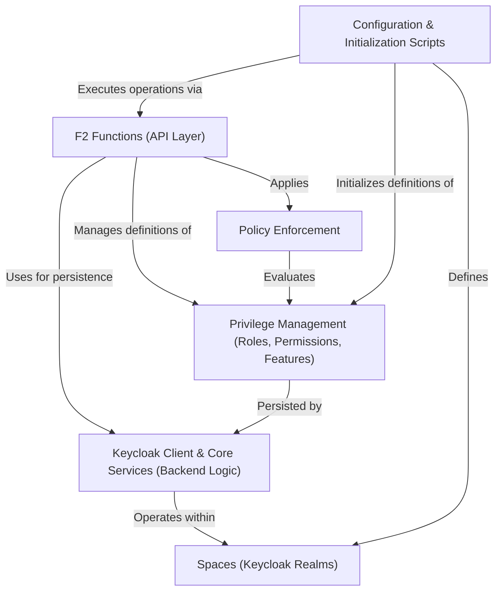

# Tutorial: connect-im

`connect-im` is a microservice for **Identity and Access Management (IAM)**.
It allows managing *digital identities* (Users, API Keys) and *groups* (Organizations)
within isolated environments called **Spaces** (which are Keycloak Realms).
The system uses **Keycloak** as its core identity engine.
Functionalities are exposed via **F2 Functions** (an API layer).
Access control is handled through **Privilege Management** (defining Roles, Permissions, and Features)
and enforced by a **Policy Enforcement** layer.
**Configuration & Initialization Scripts** automate the setup of Spaces and their initial state.

**Source Repository:** [https://github.com/komune-io/connect-im](https://github.com/komune-io/connect-im)

## Chapters

1. [Spaces (Keycloak Realms)
](01_spaces__keycloak_realms__.md)
2. [F2 Functions (API Layer)
](02_f2_functions__api_layer__.md)
3. [Privilege Management (Roles, Permissions, Features)
](03_privilege_management__roles__permissions__features__.md)
4. [Keycloak Client & Core Services (Backend Logic)
](04_keycloak_client___core_services__backend_logic__.md)
5. [Policy Enforcement
](05_policy_enforcement_.md)
6. [Configuration & Initialization Scripts
](06_configuration___initialization_scripts_.md)

---

Generated by [AI Codebase Knowledge Builder](https://github.com/The-Pocket/Tutorial-Codebase-Knowledge)